# Diagram Alur Sistem Kuis LMS2025

Dokumen ini menjelaskan alur lengkap sistem kuis dari pendaftaran instruktur hingga monitoring hasil.

---

## 1. Alur Besar (Overview)

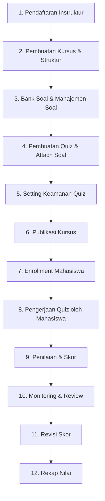

---

## 2. Pendaftaran & Persetujuan Instruktur

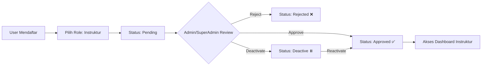

**Route terkait:**
| Aksi | Route |
|------|-------|
| Daftar Instruktur | `POST /register` |
| Halaman Pending | `GET /instructor/pending` |
| Admin Approve | `PATCH /admin/applications/{id}/approve` |
| Admin Reject | `PATCH /admin/applications/{id}/reject` |

---

## 3. Pembuatan Kursus, Modul & Pelajaran

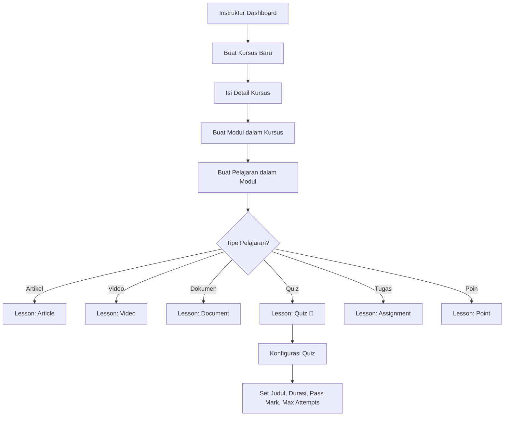

**Hierarki Struktur:**

```
Kursus (Course)
├── Modul 1
│   ├── Pelajaran 1 (Artikel)
│   ├── Pelajaran 2 (Video)
│   └── Pelajaran 3 (Quiz) ← FOKUS DOKUMEN INI
├── Modul 2
│   └── ...
└── Modul N
```

**Route terkait:**
| Aksi | Route |
|------|-------|
| Buat Kursus | `POST /instructor/courses` |
| Buat Modul | `POST /instructor/courses/{course}/modules` |
| Buat Pelajaran | `POST /instructor/modules/{module}/lessons` |

---

## 4. Bank Soal & Manajemen Soal

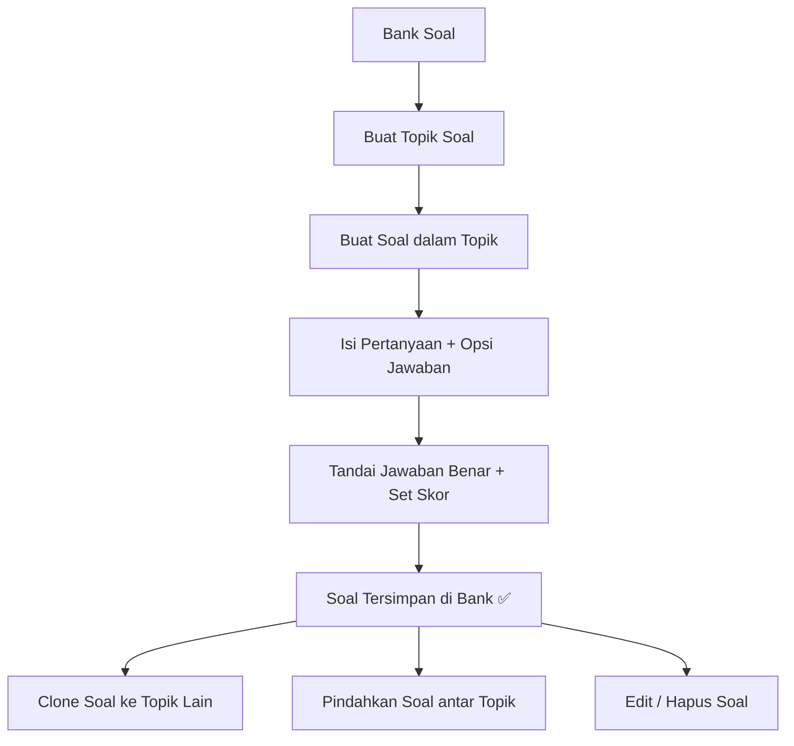

**Route terkait:**
| Aksi | Route |
|------|-------|
| List Topik | `GET /instructor/question-topics` |
| Buat Topik | `POST /instructor/question-topics` |
| Buat Soal | `POST /instructor/question-topics/{topic}/questions` |
| Clone Soal | `POST /questions/{question}/clone` |
| Pindah Topik | `PATCH /questions/{question}/move` |

---

## 5. Attach Soal ke Quiz

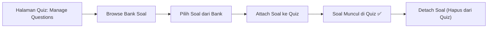

**Route terkait:**
| Aksi | Route |
|------|-------|
| Manage Questions | `GET /instructor/quizzes/{quiz}/manage-questions` |
| Browse Bank | `GET /instructor/quizzes/{quiz}/browse-bank` |
| Attach Soal | `POST /instructor/quizzes/{quiz}/attach-questions` |
| Detach Soal | `DELETE /instructor/quizzes/{quiz}/detach-question/{question}` |

---

## 6. Setting Keamanan Quiz (Proctoring)

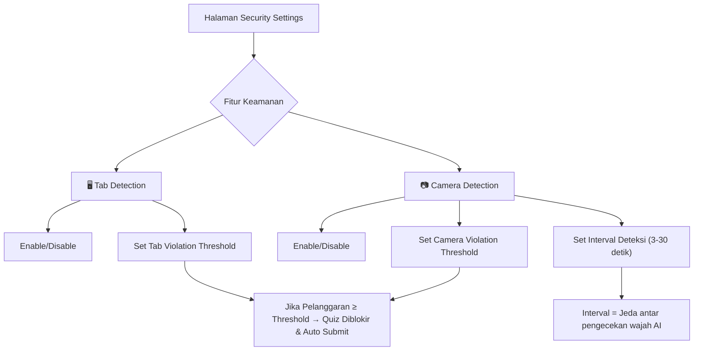

**Penjelasan Setting:**

| Setting                           | Deskripsi                                      |
| --------------------------------- | ---------------------------------------------- |
| `enable_tab_detection`            | Deteksi perpindahan tab/window                 |
| `tab_violation_threshold`         | Batas pelanggaran tab sebelum quiz diblokir    |
| `enable_camera_detection`         | Aktifkan webcam AI untuk deteksi wajah         |
| `camera_violation_threshold`      | Batas pelanggaran kamera sebelum quiz diblokir |
| `face_detection_interval_seconds` | Jeda (detik) antar pengecekan wajah oleh AI    |

**Route terkait:**
| Aksi | Route |
|------|-------|
| Edit Setting | `GET /quiz/{quiz}/security` |
| Simpan Setting | `POST /quiz/{quiz}/security` |
| Hapus Setting | `DELETE /quiz/{quiz}/security` |

---

## 7. Publikasi Kursus & Enrollment Mahasiswa

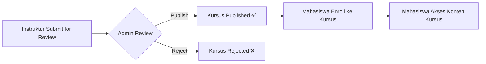

**Route terkait:**
| Aksi | Route |
|------|-------|
| Submit Review | `PATCH /instructor/courses/{course}/submit-review` |
| Admin Publish | `PATCH /admin/publication/{course}/publish` |
| Enroll Mahasiswa | `POST /admin/course-enrollments/{course}` |

---

## 8. Pengerjaan Quiz oleh Mahasiswa

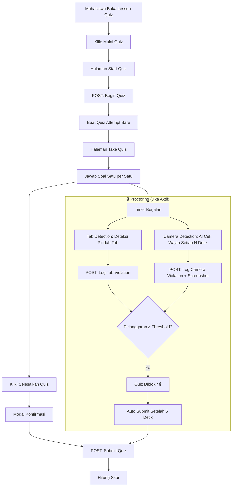

**Proses Perhitungan Skor saat Submit:**

```
1. Loop setiap soal → cek jawaban → hitung totalScore (skor mentah)
2. maxPossibleScore = sum(semua skor soal)
3. percentageScore = (totalScore / maxPossibleScore) × 100
4. scaled_score = round(percentageScore, 2)       ← DISIMPAN KE DB
5. status = percentageScore >= pass_mark ? 'passed' : 'failed'
6. Simpan: score, scaled_score, status, end_time
```

**3 Jenis Skor yang Disimpan:**

| Kolom           | Keterangan                      | Kapan Diisi              |
| --------------- | ------------------------------- | ------------------------ |
| `score`         | Skor mentah (jumlah poin benar) | Saat submit              |
| `scaled_score`  | Skor skala 0-100                | Saat submit              |
| `revised_score` | Skor revisi instruktur          | Saat instruktur merevisi |

**Route terkait:**
| Aksi | Route |
|------|-------|
| Start Quiz | `GET /student/quiz/{quiz}/start` |
| Begin Quiz | `POST /student/quiz/{quiz}/begin` |
| Take Quiz | `GET /student/quiz/attempt/{attempt}` |
| Submit Quiz | `POST /student/quiz/attempt/{attempt}/submit` |
| Hasil Quiz | `GET /student/quiz/attempt/{attempt}/result` |
| Log Tab | `POST /student/quiz/attempt/{attempt}/log-tab-violation` |
| Log Camera | `POST /student/quiz/attempt/{attempt}/log-camera-violation` |

---

## 9. Halaman Hasil Quiz (Student)

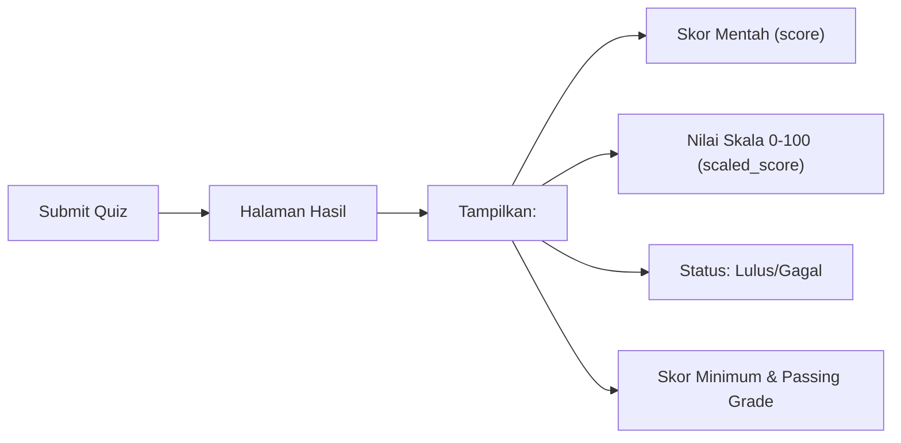

---

## 10. Monitoring & Review oleh Instruktur

### 10a. Monitoring Per Kursus

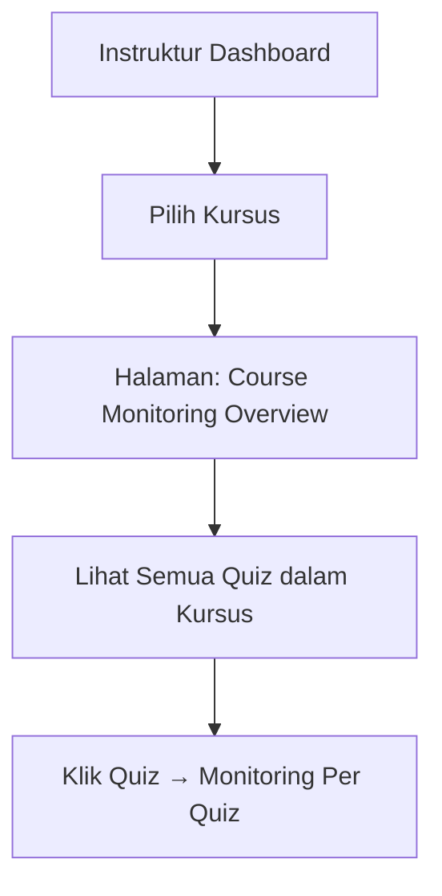

**Route:** `GET /course/{course}/monitoring`

---

### 10b. Monitoring Per Quiz

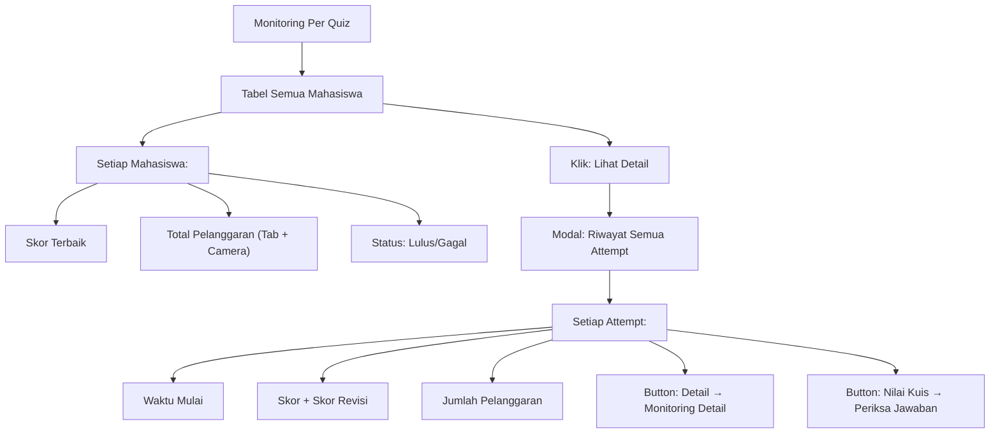

**Route:** `GET /quiz/{quiz}/monitoring`

---

### 10c. Monitoring Per Attempt (Detail)

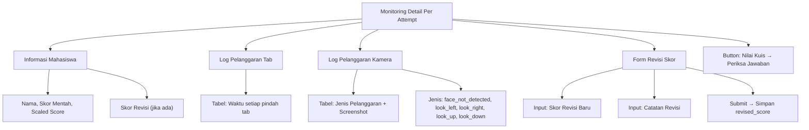

**Route:** `GET /quiz/attempt/{attempt}/monitoring-detail`

---

## 11. Periksa Jawaban & Revisi Skor

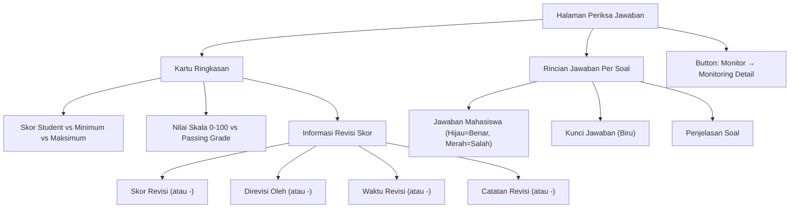

**Route:** `GET /instructor/quiz-attempts/{attempt}/review`

---

## 12. Hasil Kuis (Daftar Per Quiz)

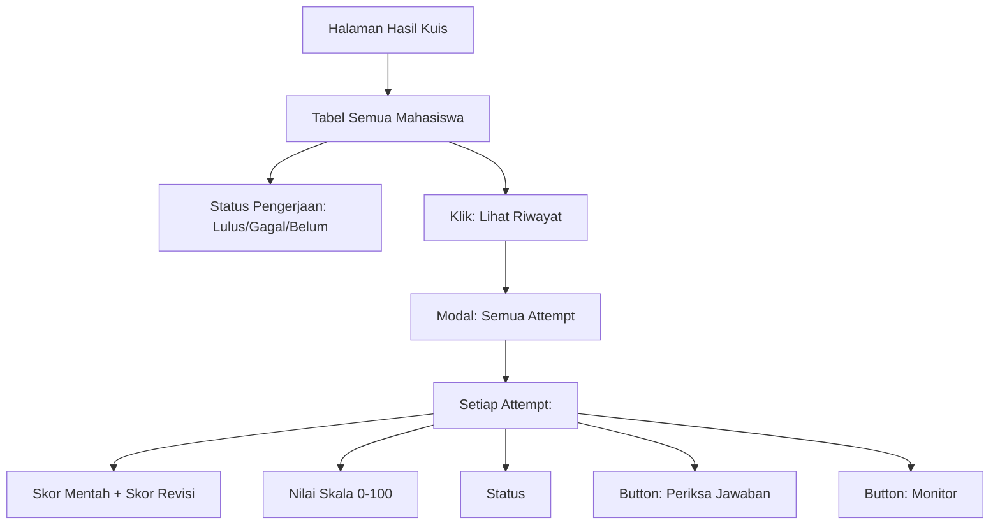

**Route:** `GET /instructor/quizzes/{quiz}/results`

---

## 13. Rekap Nilai Per Modul

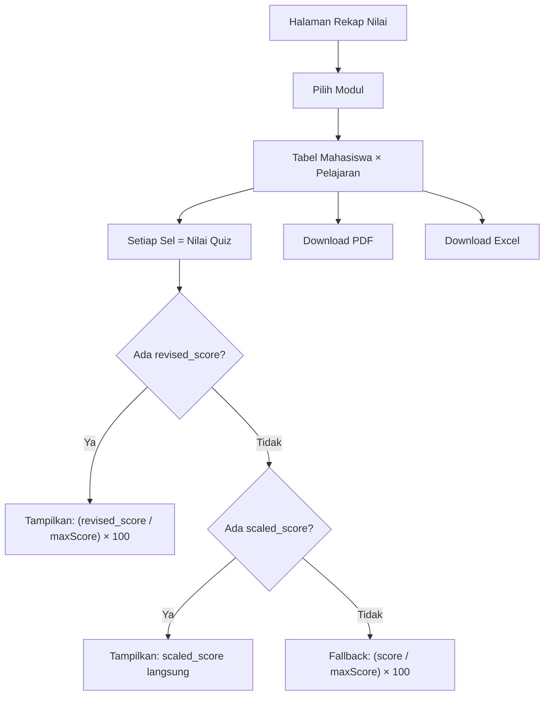

**Prioritas Skor di Rekap:**

```
1. revised_score (jika instruktur sudah merevisi) → dihitung ulang ke skala 0-100
2. scaled_score (jika tersedia di database) → langsung dipakai
3. Fallback: hitung manual dari score/maxScore × 100 (untuk data lama)
```

**Route terkait:**
| Aksi | Route |
|------|-------|
| Halaman Rekap | `GET /instructor/courses/{course}/recap` |
| Data Modul (AJAX) | `GET /instructor/modules/{module}/recap-data` |
| Download PDF | `GET /instructor/modules/{module}/recap/pdf` |
| Download Excel | `GET /instructor/modules/{module}/recap/excel` |

---

## 14. Navigasi Antar Halaman

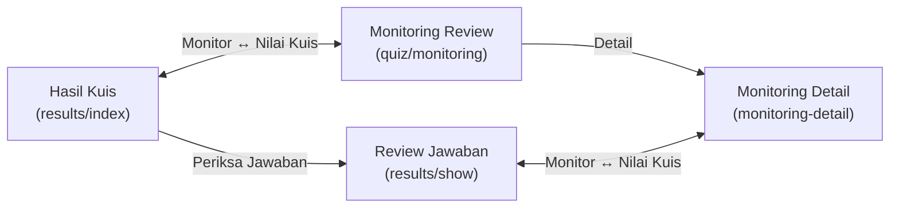

| Dari Halaman           | Button         | Menuju            |
| ---------------------- | -------------- | ----------------- |
| Hasil Kuis (index)     | **Monitor**    | Monitoring Detail |
| Periksa Jawaban (show) | **Monitor**    | Monitoring Detail |
| Monitoring Review      | **Nilai Kuis** | Periksa Jawaban   |
| Monitoring Detail      | **Nilai Kuis** | Periksa Jawaban   |
