# Dokumentasi Teknis: Alur Kode Sistem Kuis LMS2025

Dokumen ini menjelaskan alur teknis kode dari perspektif **Controller → Model → View → Database** untuk seluruh fitur sistem kuis.

---

## Arsitektur Data (Entity Relationship)

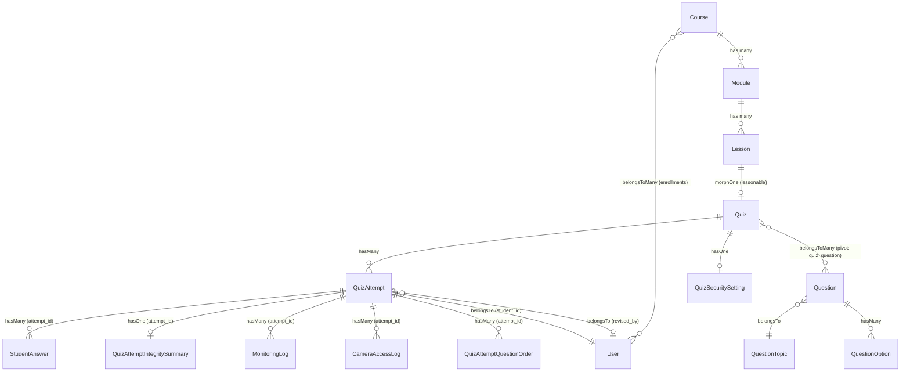

---

## Tabel `quiz_attempts` — Kolom Skor

```
┌─────────────────┬──────────────────────────────────────────────────┬──────────────────┐
│ Kolom           │ Deskripsi                                        │ Diisi Saat       │
├─────────────────┼──────────────────────────────────────────────────┼──────────────────┤
│ score           │ Skor mentah (jumlah poin benar)                  │ submit()         │
│ scaled_score    │ (score / maxScore) × 100, skala 0-100            │ submit()         │
│ revised_score   │ Skor mentah revisi dari instruktur               │ reviseScore()    │
│ revised_by      │ FK → users.id (instruktur yang merevisi)         │ reviseScore()    │
│ revised_at      │ Timestamp revisi                                 │ reviseScore()    │
│ revision_note   │ Catatan alasan revisi                            │ reviseScore()    │
└─────────────────┴──────────────────────────────────────────────────┴──────────────────┘
```

---

## Model `QuizAttempt` — Accessor `effective_score`

```php
// File: app/Models/QuizAttempt.php
// Accessor: $attempt->effective_score

public function getEffectiveScoreAttribute()
{
    // PRIORITAS 1: Skor revisi instruktur
    if ($this->revised_score !== null) {
        return $this->revised_score;
    }
    // PRIORITAS 2: Scaled score dari database
    if ($this->scaled_score !== null) {
        return $this->scaled_score;
    }
    // PRIORITAS 3: Fallback kalkulasi manual (data lama)
    if ($this->score !== null && $this->relationLoaded('quiz')) {
        $maxScore = $this->quiz->questions->sum('score');
        return ($maxScore > 0) ? min(100, round(($this->score / $maxScore) * 100, 2)) : 0;
    }
    return $this->score;
}
```

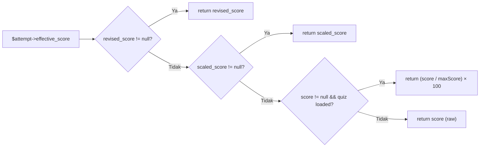

---

## FLOW 1: Student Memulai Quiz

### 1a. `StudentQuizController::start()`

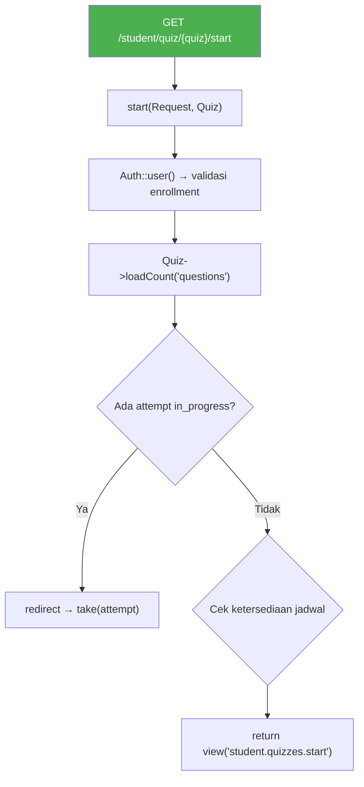

**Data Flow:**

```
Route: GET /student/quiz/{quiz}/start
Controller: StudentQuizController::start(Request $request, Quiz $quiz)
Model Query:
  ├── $quiz->lesson->module->course (Navigasi hierarki)
  ├── $student->enrollments()->where('courses.id', $course->id)->exists()
  ├── $student->quizAttempts()->where('quiz_id', $quiz->id)->count()
  ├── QuizAttempt::where('quiz_id',...)->where('status','in_progress')->first()
  └── QuizAttempt::where('student_id',...)->orderBy('created_at','desc')->first()
View: student.quizzes.start
  └── compact('quiz', 'is_preview', 'attemptCount', 'lastAttempt', 'isAvailable', 'availabilityMessage')
```

---

### 1b. `StudentQuizController::begin()`

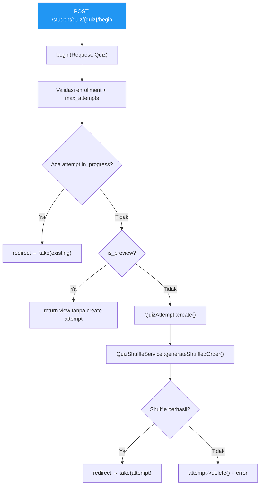

**Data Flow:**

```
Route: POST /student/quiz/{quiz}/begin
Controller: StudentQuizController::begin(Request $request, Quiz $quiz)
Model:
  ├── QuizAttempt::create([quiz_id, student_id, status='in_progress', start_time=now()])
  └── QuizShuffleService::generateShuffledOrder($attempt)
        └── INSERT INTO quiz_attempt_question_orders (attempt_id, question_id, shuffled_order)
Redirect → student.quiz.take
```

---

### 1c. `StudentQuizController::take()`

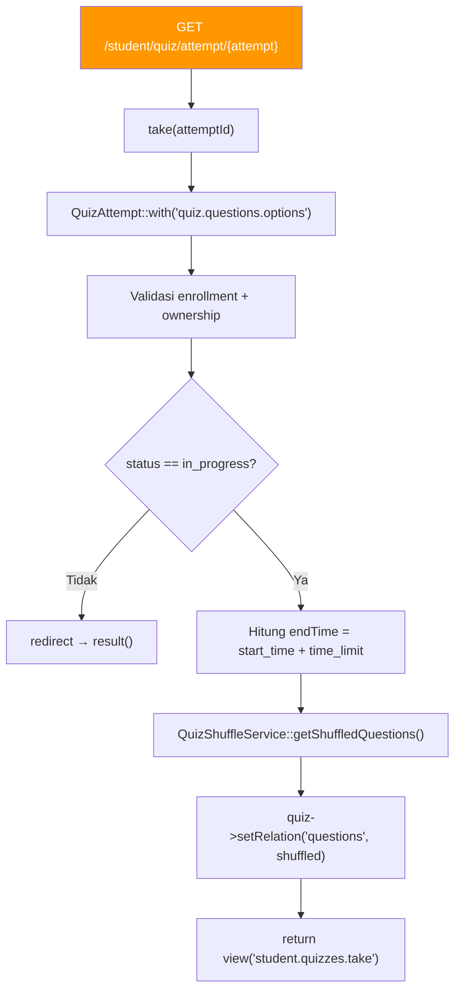

**Data Flow:**

```
Route: GET /student/quiz/attempt/{attempt}
Controller: StudentQuizController::take($attemptId)
Model Query:
  ├── QuizAttempt::with('quiz.questions.options')->findOrFail($attemptId)
  └── QuizShuffleService::getShuffledQuestions($attempt)
        ├── $attempt->questionOrders()->with('question.options')->orderBy('shuffled_order')->get()
        └── Fallback: $attempt->quiz->questions (jika belum dishuffle)
View: student.quizzes.take
  └── compact('attempt', 'is_preview', 'endTime')
JavaScript (di view):
  ├── Timer countdown (endTime)
  ├── Tab Detection (Page Visibility API → POST log_tab_violation)
  └── Camera Detection (MediaPipe Face Mesh → POST log_camera_violation)
```

---

### 1d. `StudentQuizController::submit()` — Perhitungan Skor

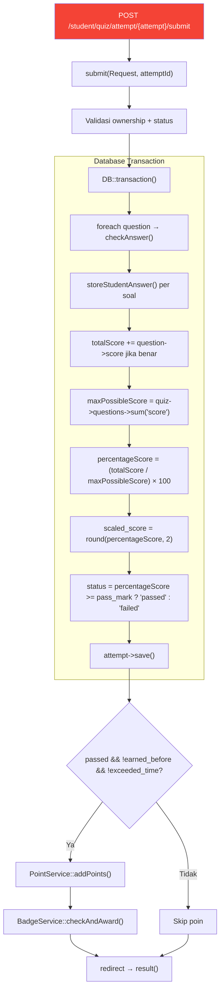

**Data Flow Detail:**

```
Route: POST /student/quiz/attempt/{attempt}/submit
Controller: StudentQuizController::submit(Request $request, $attemptId)

STEP 1 — Cek Jawaban:
  foreach ($quizQuestions as $question):
    ├── checkAnswer($question, $userAnswer)
    │     ├── multiple_choice: $userAnswer == $question->correct_answer
    │     ├── checkbox: compare array jawaban
    │     └── dropdown: $userAnswer == $question->correct_answer
    ├── storeStudentAnswer($attempt, $question, $userAnswer, $isCorrect)
    │     └── INSERT INTO student_answers (attempt_id, question_id, answer, is_correct)
    └── if (isCorrect) totalScore += $question->score

STEP 2 — Simpan Skor:
  $attempt->score = $totalScore                          // Skor mentah
  $attempt->scaled_score = round($percentageScore, 2)    // Skala 0-100
  $attempt->status = 'passed' | 'failed'
  $attempt->end_time = now()
  $attempt->save()   →  UPDATE quiz_attempts SET score, scaled_score, status, end_time

STEP 3 — Poin & Badge:
  PointService::addPoints(user, course, 'pass_quiz', lesson)
    └── INSERT INTO point_histories + UPDATE course_user.points_earned
  BadgeService::checkAndAward(user, course)
    └── Cek syarat badge → INSERT INTO badge_awards

Redirect → student.quiz.result
```

---

## FLOW 2: Proctoring (Tab & Camera Detection)

### 2a. Tab Detection — JavaScript → Server

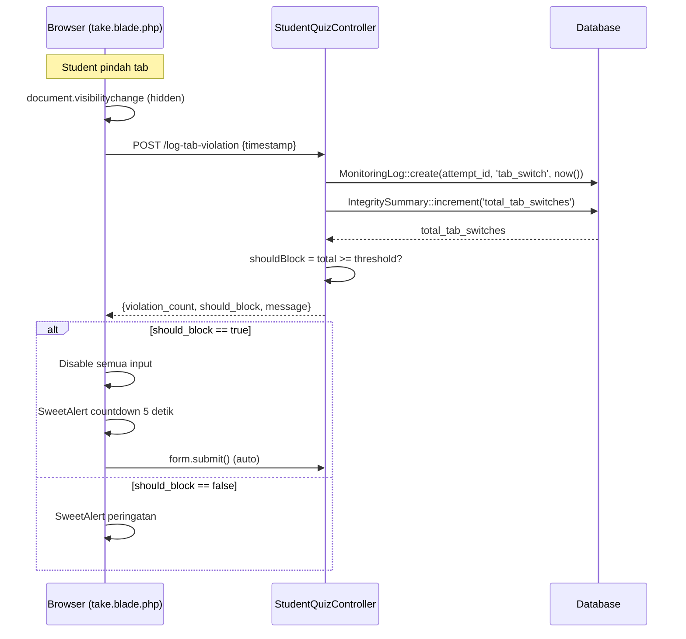

**Kode Server:**

```
Controller: StudentQuizController::logTabViolation($request, $attemptId)
Model:
  ├── MonitoringLog::create([
  │     'attempt_id' => $attempt->id,
  │     'violation_type' => 'tab_switch',
  │     'violation_timestamp' => now()
  │   ])
  ├── QuizAttemptIntegritySummary::firstOrCreate(['attempt_id' => ...])
  └── $summary->increment('total_tab_switches')
Response JSON:
  └── { success, violation_count, threshold, should_block, message }
```

---

### 2b. Camera Detection — MediaPipe → Server

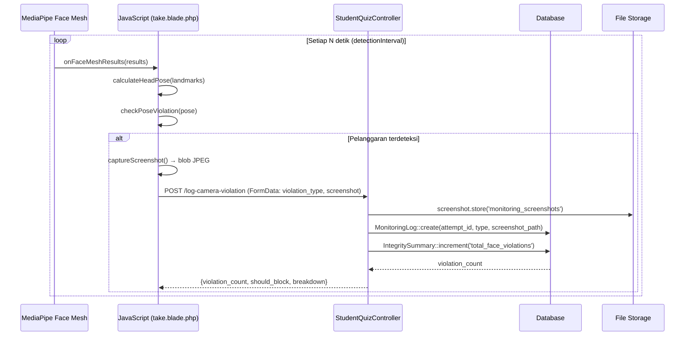

**Jenis Pelanggaran Kamera:**

```
┌─────────────────────┬────────────────────────────────────────┐
│ violation_type       │ Kondisi Deteksi                       │
├─────────────────────┼────────────────────────────────────────┤
│ face_not_detected   │ Tidak ada wajah (3× berturut)         │
│ look_left           │ yaw < -0.3 (YAW_THRESHOLD)            │
│ look_right          │ yaw > 0.3                             │
│ look_up             │ pitch < -0.15 (PITCH_UP_THRESHOLD)    │
│ look_down           │ pitch > 0.2 (PITCH_DOWN_THRESHOLD)    │
└─────────────────────┴────────────────────────────────────────┘
```

**Head Pose Calculation:**

```javascript
// calculateHeadPose(landmarks) di take.blade.php

landmarks[1]   → Ujung hidung (nose)
landmarks[152] → Dagu (chin)
landmarks[33]  → Mata kiri (leftEye)
landmarks[263] → Mata kanan (rightEye)

yaw   = (noseToRightEye - noseToLeftEye) / eyeDistance
pitch = (eyeToNose / faceHeight) - 0.5
```

---

## FLOW 3: Hasil Quiz (Student)

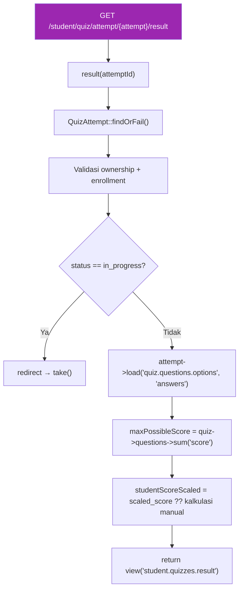

**Data Flow:**

```
Route: GET /student/quiz/attempt/{attempt}/result
Controller: StudentQuizController::result($attemptId)
View: student.quizzes.result
  └── compact('attempt', 'is_preview', 'maxPossibleScore', 'minimumScore',
              'studentScoreScaled', 'minimumScoreScaled')
```

---

## FLOW 4: Instruktur — Daftar Hasil Quiz

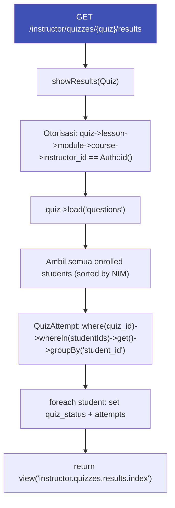

**Data Flow:**

```
Route: GET /instructor/quizzes/{quiz}/results
Controller: InstructorQuizController::showResults(Quiz $quiz)
Model Query:
  ├── $quiz->load('questions')
  ├── $course->students()
  │     ->join('student_profiles', ...)
  │     ->orderByRaw('CAST(unique_id_number AS UNSIGNED) ASC')
  │     ->get()
  └── QuizAttempt::where('quiz_id', $quiz->id)
        ->whereIn('student_id', $studentIds)
        ->get()
        ->groupBy('student_id')
View: instructor.quizzes.results.index
  └── compact('quiz', 'enrolledStudents', 'minimumScore', 'totalMaxScore', 'minimumScoreScaled')
```

---

## FLOW 5: Instruktur — Periksa Jawaban (Review Attempt)

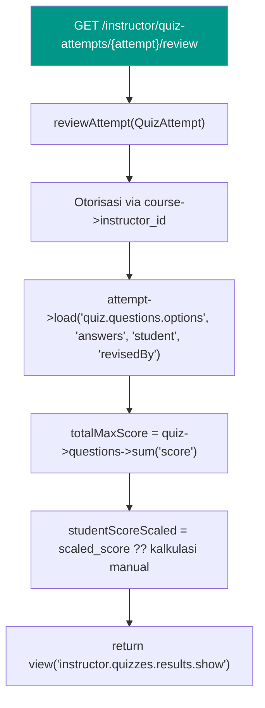

**Data ke View:**

```
View: instructor.quizzes.results.show
  ├── $attempt (dengan relasi quiz, answers, student, revisedBy)
  ├── $totalMaxScore
  ├── $minimumScore = (pass_mark / 100) × totalMaxScore
  ├── $studentScoreScaled = scaled_score ?? kalkulasi manual
  └── $minimumScoreScaled = quiz->pass_mark

View menampilkan:
  ├── Skor mentah ($attempt->score) vs min ($minimumScore) vs max ($totalMaxScore)
  ├── Nilai skala ($studentScoreScaled) vs passing grade ($minimumScoreScaled)
  ├── Info revisi: revised_score, revisedBy->name, revised_at, revision_note
  ├── Button "Monitor" → route('instructor.quiz.monitoring.detail', $attempt->id)
  └── Per soal: jawaban student, kunci jawaban, status benar/salah
```

---

## FLOW 6: Instruktur — Monitoring Review (Per Quiz)

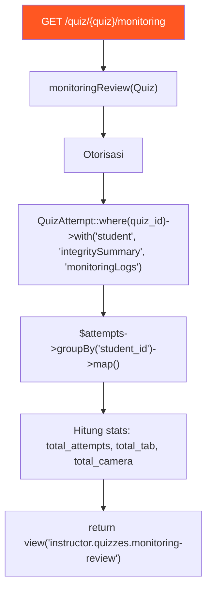

**Struktur Data `$attemptsByStudent`:**

```php
$attemptsByStudent = [
    student_id_1 => [
        'student'        => User,            // Relasi student
        'latest_attempt' => QuizAttempt,     // Attempt terbaru
        'all_attempts'   => Collection       // Semua attempts (untuk modal history)
    ],
    student_id_2 => [ ... ],
];
```

**Navigasi dari View:**

```
monitoring-review.blade.php
  ├── Per student row: tombol "Lihat Detail" → modal history
  └── Modal History per attempt:
        ├── Button "Detail"     → route('instructor.quiz.monitoring.detail', $attempt->id)
        └── Button "Nilai Kuis" → route('instructor.quiz.review_attempt', $attempt->id)
```

---

## FLOW 7: Instruktur — Monitoring Detail (Per Attempt)

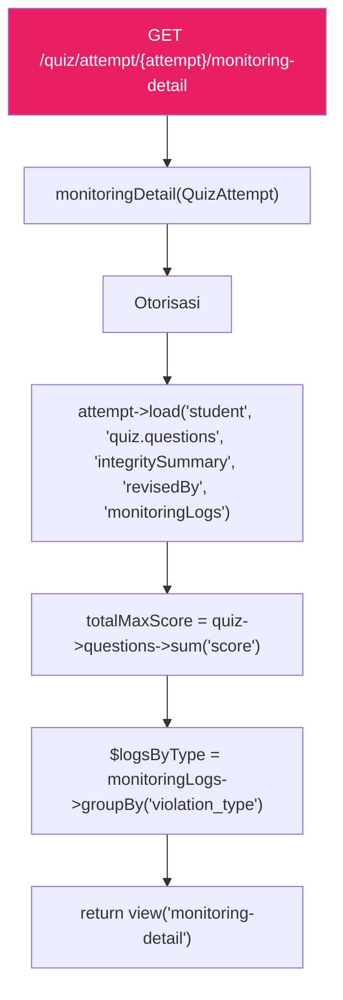

**Struktur Data `$logsByType`:**

```php
$logsByType = [
    'tab_switch' => Collection [
        MonitoringLog { violation_timestamp, screenshot_path: null },
        ...
    ],
    'face_not_detected' => Collection [
        MonitoringLog { violation_timestamp, screenshot_path: 'monitoring_screenshots/xxx.jpg' },
        ...
    ],
    'look_left'  => Collection [ ... ],
    'look_right' => Collection [ ... ],
];
```

---

## FLOW 8: Instruktur — Revisi Skor

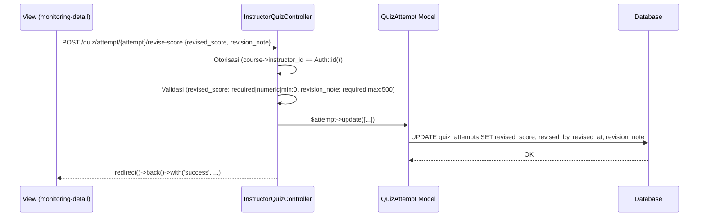

**Data yang Disimpan:**

```php
$attempt->update([
    'revised_score' => $request->revised_score,  // Skor mentah baru
    'revised_by'    => Auth::id(),               // ID instruktur
    'revised_at'    => now(),                    // Timestamp
    'revision_note' => $request->revision_note,  // Alasan
]);

// CATATAN: $attempt->score TIDAK berubah (skor asli tetap utuh)
// Efek: $attempt->effective_score sekarang return revised_score
```

---

## FLOW 9: Security Settings

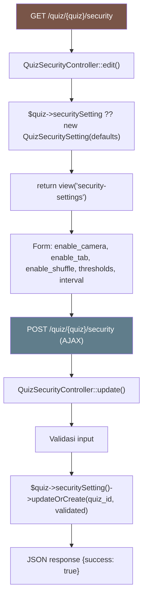

**Tabel `quiz_security_settings`:**

```
┌───────────────────────────────────┬──────────┬──────────┐
│ Kolom                             │ Tipe     │ Default  │
├───────────────────────────────────┼──────────┼──────────┤
│ quiz_id (FK)                      │ integer  │ -        │
│ enable_camera_detection           │ boolean  │ false    │
│ enable_tab_detection              │ boolean  │ false    │
│ enable_question_shuffle           │ boolean  │ false    │
│ camera_violation_threshold        │ integer  │ 3        │
│ tab_violation_threshold           │ integer  │ 5        │
│ face_detection_interval_seconds   │ integer  │ 5        │
└───────────────────────────────────┴──────────┴──────────┘
```

---

## FLOW 10: Rekap Nilai

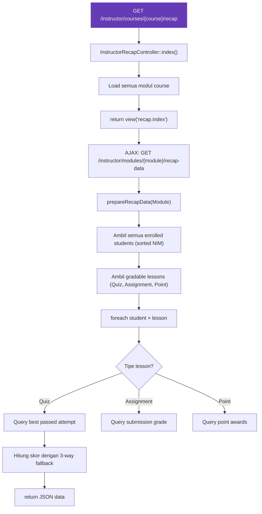

**3-Way Skor Fallback di Rekap:**

```php
// InstructorRecapController::prepareRecapData()

if ($bestAttempt->revised_score !== null) {
    // PRIORITAS 1: revised_score → scale ulang
    $rawScore = $bestAttempt->revised_score;
    $scaledScore = ($quizMaxScore > 0)
        ? min(100, round(($rawScore / $quizMaxScore) * 100, 2)) : 0;

} elseif ($bestAttempt->scaled_score !== null) {
    // PRIORITAS 2: scaled_score → pakai langsung
    $rawScore = $bestAttempt->score;
    $scaledScore = $bestAttempt->scaled_score;

} else {
    // PRIORITAS 3: fallback kalkulasi manual
    $rawScore = $bestAttempt->score;
    $scaledScore = ($quizMaxScore > 0)
        ? min(100, round(($rawScore / $quizMaxScore) * 100, 2)) : 0;
}
```

---

## Peta Lengkap: Controller → View → Navigasi

```mermaid
flowchart TB
    subgraph StudentControllers ["Student Controllers"]
        SC_start["StudentQuizController::start()"]
        SC_begin["StudentQuizController::begin()"]
        SC_take["StudentQuizController::take()"]
        SC_submit["StudentQuizController::submit()"]
        SC_result["StudentQuizController::result()"]
        SC_logTab["StudentQuizController::logTabViolation()"]
        SC_logCam["StudentQuizController::logCameraViolation()"]
    end

    subgraph InstructorControllers ["Instructor Controllers"]
        IC_results["InstructorQuizController::showResults()"]
        IC_review["InstructorQuizController::reviewAttempt()"]
        IC_monReview["InstructorQuizController::monitoringReview()"]
        IC_monDetail["InstructorQuizController::monitoringDetail()"]
        IC_revise["InstructorQuizController::reviseScore()"]
        IC_courseOverview["InstructorQuizController::courseMonitoringOverview()"]
        RC_recap["InstructorRecapController::prepareRecapData()"]
    end

    subgraph Views ["Blade Views"]
        V_start["student/quizzes/start"]
        V_take["student/quizzes/take"]
        V_result["student/quizzes/result"]
        V_resIndex["instructor/quizzes/results/index"]
        V_resShow["instructor/quizzes/results/show"]
        V_monReview["instructor/quizzes/monitoring-review"]
        V_monDetail["instructor/quizzes/monitoring-detail"]
        V_recapIndex["instructor/recap/index"]
    end

    SC_start --> V_start
    SC_begin -->|redirect| SC_take
    SC_take --> V_take
    SC_submit -->|redirect| SC_result
    SC_result --> V_result

    V_take -->|AJAX| SC_logTab
    V_take -->|AJAX| SC_logCam

    IC_results --> V_resIndex
    IC_review --> V_resShow
    IC_monReview --> V_monReview
    IC_monDetail --> V_monDetail
    IC_revise -->|redirect back| V_monDetail

    V_resIndex -.->|"Button: Monitor"| V_monDetail
    V_resShow -.->|"Button: Monitor"| V_monDetail
    V_monReview -.->|"Button: Detail"| V_monDetail
    V_monReview -.->|"Button: Nilai Kuis"| V_resShow
    V_monDetail -.->|"Button: Nilai Kuis"| V_resShow
```

---

## Referensi File

| Komponen                    | Path                                                                                  |
| --------------------------- | ------------------------------------------------------------------------------------- |
| **Model**                   |                                                                                       |
| QuizAttempt                 | `app/Models/QuizAttempt.php`                                                          |
| Quiz                        | `app/Models/Quiz.php`                                                                 |
| QuizSecuritySetting         | `app/Models/QuizSecuritySetting.php`                                                  |
| MonitoringLog               | `app/Models/MonitoringLog.php`                                                        |
| QuizAttemptIntegritySummary | `app/Models/QuizAttemptIntegritySummary.php`                                          |
| **Controller**              |                                                                                       |
| StudentQuizController       | `app/Http/Controllers/Student/StudentQuizController.php`                              |
| InstructorQuizController    | `app/Http/Controllers/Instructor/InstructorQuizController.php`                        |
| QuizSecurityController      | `app/Http/Controllers/Instructor/QuizSecurityController.php`                          |
| InstructorRecapController   | `app/Http/Controllers/Instructor/InstructorRecapController.php`                       |
| **View**                    |                                                                                       |
| Quiz Start                  | `resources/views/student/quizzes/start.blade.php`                                     |
| Quiz Take (+ JS Proctoring) | `resources/views/student/quizzes/take.blade.php`                                      |
| Quiz Result                 | `resources/views/student/quizzes/result.blade.php`                                    |
| Results Index               | `resources/views/instructor/quizzes/results/index.blade.php`                          |
| Results Show                | `resources/views/instructor/quizzes/results/show.blade.php`                           |
| Monitoring Review           | `resources/views/instructor/quizzes/monitoring-review.blade.php`                      |
| Monitoring Detail           | `resources/views/instructor/quizzes/monitoring-detail.blade.php`                      |
| Security Settings           | `resources/views/instructor/quizzes/security-settings.blade.php`                      |
| **Service**                 |                                                                                       |
| QuizShuffleService          | `app/Services/QuizShuffleService.php`                                                 |
| PointService                | `app/Services/PointService.php`                                                       |
| BadgeService                | `app/Services/BadgeService.php`                                                       |
| **Migration**               |                                                                                       |
| Quiz Attempts               | `database/migrations/..._create_quiz_attempts_table.php`                              |
| Score Revision              | `database/migrations/2026_02_17_000000_add_score_revision_to_quiz_attempts_table.php` |
| Scaled Score                | `database/migrations/2026_02_17_100000_add_scaled_score_to_quiz_attempts_table.php`   |
| Security Settings           | `database/migrations/2026_01_06_103138_create_quiz_security_settings_table.php`       |
| **Routes**                  | `routes/web.php` (line 151-178 student, 311-484 instructor)                           |
