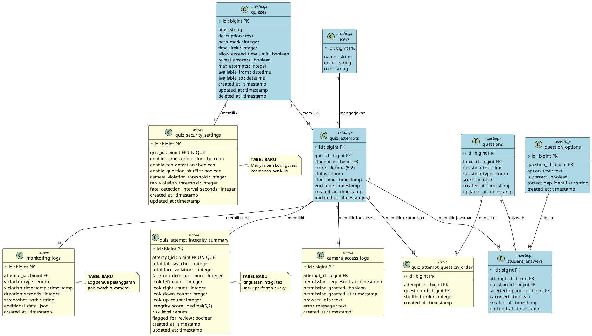

# Rancangan Database - Format Draw.io

## Fitur Keamanan Kuis Online - Platform E-Learning EduGames

## Cara Menggunakan:

1. Buka https://app.diagrams.net/ (Draw.io)
2. File > Import from > Text
3. Copy paste kode di bawah ini
4. Pilih format yang diinginkan

---

## ERD - Entity Relationship Diagram (Format Draw.io CSV)

```csv
# Entity Relationship Diagram - Fitur Keamanan Kuis
# Paste this into Draw.io: Arrange > Insert > Advanced > CSV

## Configuration
# stylename=shape
# styles={"entity":"rounded=1;whiteSpace=wrap;html=1;fillColor=#dae8fc;strokeColor=#6c8ebf;","relationship":"rhombus;whiteSpace=wrap;html=1;fillColor=#fff2cc;strokeColor=#d6b656;"}
# identity=id
# parent=
# namespace=csvimport

## Entities
id,shape,label,width,height,style
users,entity,users\n---\nid (PK)\nname\nemail\nrole,200,120,entity
quizzes,entity,quizzes\n---\nid (PK)\ntitle\ndescription\npass_mark\ntime_limit\navailable_from\navailable_to,200,180,entity
quiz_security_settings,entity,quiz_security_settings\n---\nid (PK)\nquiz_id (FK UNIQUE)\nenable_camera_detection\nenable_tab_detection\nenable_question_shuffle\ncamera_violation_threshold\ntab_violation_threshold\nface_detection_interval_seconds,280,220,entity
quiz_attempts,entity,quiz_attempts\n---\nid (PK)\nquiz_id (FK)\nstudent_id (FK)\nscore\nstatus\nstart_time\nend_time,200,180,entity
quiz_attempt_question_order,entity,quiz_attempt_question_order\n---\nid (PK)\nattempt_id (FK)\nquestion_id (FK)\nshuffled_order,240,140,entity
monitoring_logs,entity,monitoring_logs\n---\nid (PK)\nattempt_id (FK)\nviolation_type\nviolation_timestamp\nduration_seconds\nscreenshot_path\nadditional_data,220,180,entity
quiz_attempt_integrity_summary,entity,quiz_attempt_integrity_summary\n---\nid (PK)\nattempt_id (FK UNIQUE)\ntotal_tab_switches\ntotal_face_violations\nface_not_detected_count\nlook_left_count\nlook_right_count\nlook_down_count\nlook_up_count\nintegrity_score\nrisk_level\nflagged_for_review,280,280,entity
camera_access_logs,entity,camera_access_logs\n---\nid (PK)\nattempt_id (FK)\npermission_requested_at\npermission_granted\npermission_granted_at\nbrowser_info\nerror_message,220,180,entity
questions,entity,questions\n---\nid (PK)\ntopic_id (FK)\nquestion_text\nquestion_type\nscore,200,140,entity
question_options,entity,question_options\n---\nid (PK)\nquestion_id (FK)\noption_text\nis_correct\ncorrect_gap_identifier,220,140,entity
student_answers,entity,student_answers\n---\nid (PK)\nattempt_id (FK)\nquestion_id (FK)\nselected_option_id (FK)\nis_correct,220,140,entity

## Relationships
# connect={"from":"source","to":"target","invert":false,"style":"edgeStyle=orthogonalEdgeStyle;rounded=0;orthogonalLoop=1;jettySize=auto;html=1;"}
source,target,label,style
users,quiz_attempts,1:N\nmengerjakan,edgeStyle=orthogonalEdgeStyle;rounded=0;orthogonalLoop=1;jettySize=auto;html=1;endArrow=ERmany;
quizzes,quiz_attempts,1:N\nmemiliki,edgeStyle=orthogonalEdgeStyle;rounded=0;orthogonalLoop=1;jettySize=auto;html=1;endArrow=ERmany;
quizzes,quiz_security_settings,1:1\nmemiliki,edgeStyle=orthogonalEdgeStyle;rounded=0;orthogonalLoop=1;jettySize=auto;html=1;endArrow=ERone;
quiz_attempts,quiz_attempt_integrity_summary,1:1\nmemiliki,edgeStyle=orthogonalEdgeStyle;rounded=0;orthogonalLoop=1;jettySize=auto;html=1;endArrow=ERone;
quiz_attempts,quiz_attempt_question_order,1:N\nmemiliki,edgeStyle=orthogonalEdgeStyle;rounded=0;orthogonalLoop=1;jettySize=auto;html=1;endArrow=ERmany;
quiz_attempts,monitoring_logs,1:N\nmemiliki,edgeStyle=orthogonalEdgeStyle;rounded=0;orthogonalLoop=1;jettySize=auto;html=1;endArrow=ERmany;
quiz_attempts,camera_access_logs,1:N\nmemiliki,edgeStyle=orthogonalEdgeStyle;rounded=0;orthogonalLoop=1;jettySize=auto;html=1;endArrow=ERmany;
quiz_attempts,student_answers,1:N\nmemiliki,edgeStyle=orthogonalEdgeStyle;rounded=0;orthogonalLoop=1;jettySize=auto;html=1;endArrow=ERmany;
questions,quiz_attempt_question_order,1:N\nmuncul di,edgeStyle=orthogonalEdgeStyle;rounded=0;orthogonalLoop=1;jettySize=auto;html=1;endArrow=ERmany;
questions,student_answers,1:N\ndijawab,edgeStyle=orthogonalEdgeStyle;rounded=0;orthogonalLoop=1;jettySize=auto;html=1;endArrow=ERmany;
question_options,student_answers,1:N\ndipilih,edgeStyle=orthogonalEdgeStyle;rounded=0;orthogonalLoop=1;jettySize=auto;html=1;endArrow=ERmany;
```

---

## Alternatif: Format PlantUML untuk Draw.io

Draw.io juga mendukung PlantUML. Cara menggunakan:

1. Buka Draw.io
2. Klik menu: Arrange > Insert > Advanced > PlantUML
3. Paste kode di bawah ini



---

## Format XML Draw.io (Direct Import)

Cara menggunakan:

1. Simpan kode di bawah sebagai file .drawio atau .xml
2. Buka Draw.io
3. File > Open from > Device
4. Pilih file yang disimpan

```xml
<mxfile host="app.diagrams.net">
  <diagram id="ERD_Keamanan_Kuis" name="Page-1">
    <mxGraphModel dx="1422" dy="794" grid="1" gridSize="10" guides="1" tooltips="1" connect="1" arrows="1" fold="1" page="1" pageScale="1" pageWidth="827" pageHeight="1169">
      <root>
        <mxCell id="0"/>
        <mxCell id="1" parent="0"/>

        <!-- quizzes -->
        <mxCell id="quizzes" value="quizzes&#xa;---&#xa;PK: id&#xa;---&#xa;title&#xa;description&#xa;pass_mark&#xa;time_limit&#xa;available_from&#xa;available_to" style="rounded=1;whiteSpace=wrap;html=1;fillColor=#dae8fc;strokeColor=#6c8ebf;align=left;verticalAlign=top;spacing=10;" vertex="1" parent="1">
          <mxGeometry x="40" y="40" width="200" height="180" as="geometry"/>
        </mxCell>

        <!-- quiz_security_settings -->
        <mxCell id="security_settings" value="quiz_security_settings&#xa;---&#xa;PK: id&#xa;FK: quiz_id (UNIQUE)&#xa;---&#xa;enable_camera_detection&#xa;enable_tab_detection&#xa;enable_question_shuffle&#xa;camera_violation_threshold&#xa;tab_violation_threshold&#xa;face_detection_interval_seconds" style="rounded=1;whiteSpace=wrap;html=1;fillColor=#fff2cc;strokeColor=#d6b656;align=left;verticalAlign=top;spacing=10;" vertex="1" parent="1">
          <mxGeometry x="320" y="40" width="280" height="220" as="geometry"/>
        </mxCell>

        <!-- quiz_attempts -->
        <mxCell id="quiz_attempts" value="quiz_attempts&#xa;---&#xa;PK: id&#xa;FK: quiz_id&#xa;FK: student_id&#xa;---&#xa;score&#xa;status&#xa;start_time&#xa;end_time" style="rounded=1;whiteSpace=wrap;html=1;fillColor=#dae8fc;strokeColor=#6c8ebf;align=left;verticalAlign=top;spacing=10;" vertex="1" parent="1">
          <mxGeometry x="40" y="300" width="200" height="180" as="geometry"/>
        </mxCell>

        <!-- monitoring_logs -->
        <mxCell id="monitoring_logs" value="monitoring_logs&#xa;---&#xa;PK: id&#xa;FK: attempt_id&#xa;---&#xa;violation_type&#xa;violation_timestamp&#xa;duration_seconds&#xa;screenshot_path&#xa;additional_data" style="rounded=1;whiteSpace=wrap;html=1;fillColor=#fff2cc;strokeColor=#d6b656;align=left;verticalAlign=top;spacing=10;" vertex="1" parent="1">
          <mxGeometry x="320" y="300" width="220" height="180" as="geometry"/>
        </mxCell>

        <!-- quiz_attempt_integrity_summary -->
        <mxCell id="integrity_summary" value="quiz_attempt_integrity_summary&#xa;---&#xa;PK: id&#xa;FK: attempt_id (UNIQUE)&#xa;---&#xa;total_tab_switches&#xa;total_face_violations&#xa;face_not_detected_count&#xa;look_left_count, look_right_count&#xa;look_down_count, look_up_count&#xa;integrity_score&#xa;risk_level&#xa;flagged_for_review" style="rounded=1;whiteSpace=wrap;html=1;fillColor=#fff2cc;strokeColor=#d6b656;align=left;verticalAlign=top;spacing=10;" vertex="1" parent="1">
          <mxGeometry x="600" y="300" width="280" height="250" as="geometry"/>
        </mxCell>

        <!-- quiz_attempt_question_order -->
        <mxCell id="question_order" value="quiz_attempt_question_order&#xa;---&#xa;PK: id&#xa;FK: attempt_id&#xa;FK: question_id&#xa;---&#xa;shuffled_order" style="rounded=1;whiteSpace=wrap;html=1;fillColor=#fff2cc;strokeColor=#d6b656;align=left;verticalAlign=top;spacing=10;" vertex="1" parent="1">
          <mxGeometry x="40" y="560" width="240" height="140" as="geometry"/>
        </mxCell>

        <!-- camera_access_logs -->
        <mxCell id="camera_logs" value="camera_access_logs&#xa;---&#xa;PK: id&#xa;FK: attempt_id&#xa;---&#xa;permission_requested_at&#xa;permission_granted&#xa;permission_granted_at&#xa;browser_info&#xa;error_message" style="rounded=1;whiteSpace=wrap;html=1;fillColor=#fff2cc;strokeColor=#d6b656;align=left;verticalAlign=top;spacing=10;" vertex="1" parent="1">
          <mxGeometry x="320" y="560" width="220" height="180" as="geometry"/>
        </mxCell>

        <!-- users -->
        <mxCell id="users" value="users&#xa;---&#xa;PK: id&#xa;---&#xa;name&#xa;email&#xa;role" style="rounded=1;whiteSpace=wrap;html=1;fillColor=#dae8fc;strokeColor=#6c8ebf;align=left;verticalAlign=top;spacing=10;" vertex="1" parent="1">
          <mxGeometry x="40" y="780" width="200" height="120" as="geometry"/>
        </mxCell>

        <!-- questions -->
        <mxCell id="questions" value="questions&#xa;---&#xa;PK: id&#xa;FK: topic_id&#xa;---&#xa;question_text&#xa;question_type&#xa;score" style="rounded=1;whiteSpace=wrap;html=1;fillColor=#dae8fc;strokeColor=#6c8ebf;align=left;verticalAlign=top;spacing=10;" vertex="1" parent="1">
          <mxGeometry x="600" y="560" width="200" height="140" as="geometry"/>
        </mxCell>

        <!-- Relationships -->
        <mxCell id="rel1" value="1:1" style="endArrow=classic;html=1;exitX=1;exitY=0.5;entryX=0;entryY=0.5;" edge="1" parent="1" source="quizzes" target="security_settings">
          <mxGeometry relative="1" as="geometry"/>
        </mxCell>

        <mxCell id="rel2" value="1:N" style="endArrow=classic;html=1;exitX=0.5;exitY=1;entryX=0.5;entryY=0;" edge="1" parent="1" source="quizzes" target="quiz_attempts">
          <mxGeometry relative="1" as="geometry"/>
        </mxCell>

        <mxCell id="rel3" value="1:N" style="endArrow=classic;html=1;exitX=1;exitY=0.5;entryX=0;entryY=0.5;" edge="1" parent="1" source="quiz_attempts" target="monitoring_logs">
          <mxGeometry relative="1" as="geometry"/>
        </mxCell>

        <mxCell id="rel4" value="1:1" style="endArrow=classic;html=1;exitX=1;exitY=0.5;entryX=0;entryY=0.5;" edge="1" parent="1" source="monitoring_logs" target="integrity_summary">
          <mxGeometry relative="1" as="geometry"/>
        </mxCell>

        <mxCell id="rel5" value="1:N" style="endArrow=classic;html=1;exitX=0.5;exitY=1;entryX=0.5;entryY=0;" edge="1" parent="1" source="quiz_attempts" target="question_order">
          <mxGeometry relative="1" as="geometry"/>
        </mxCell>

        <mxCell id="rel6" value="1:N" style="endArrow=classic;html=1;exitX=1;exitY=0.5;entryX=0;entryY=0.5;" edge="1" parent="1" source="question_order" target="camera_logs">
          <mxGeometry relative="1" as="geometry"/>
        </mxCell>

        <mxCell id="rel7" value="1:N" style="endArrow=classic;html=1;exitX=0.5;exitY=1;entryX=0.5;entryY=0;" edge="1" parent="1" source="users" target="quiz_attempts">
          <mxGeometry relative="1" as="geometry"/>
        </mxCell>

        <mxCell id="rel8" value="1:N" style="endArrow=classic;html=1;exitX=0;exitY=0.5;entryX=1;entryY=0.5;" edge="1" parent="1" source="questions" target="question_order">
          <mxGeometry relative="1" as="geometry"/>
        </mxCell>

      </root>
    </mxGraphModel>
  </diagram>
</mxfile>
```

---

## Simplified Text Format untuk Draw.io

Format paling sederhana yang bisa di-paste langsung di Draw.io:

```
quizzes
- id (PK)
- title
- description
- pass_mark
- time_limit
---
quiz_security_settings
- id (PK)
- quiz_id (FK UNIQUE)
- enable_camera_detection
- enable_tab_detection
- enable_question_shuffle
- camera_violation_threshold
- tab_violation_threshold
- face_detection_interval_seconds
---
quiz_attempts
- id (PK)
- quiz_id (FK)
- student_id (FK)
- score
- status
- start_time
- end_time
---
monitoring_logs
- id (PK)
- attempt_id (FK)
- violation_type
- violation_timestamp
- duration_seconds
- screenshot_path
- additional_data
---
quiz_attempt_integrity_summary
- id (PK)
- attempt_id (FK UNIQUE)
- total_tab_switches
- total_face_violations
- face_not_detected_count
- look_left_count
- look_right_count
- look_down_count
- look_up_count
- integrity_score
- risk_level
- flagged_for_review
---
quiz_attempt_question_order
- id (PK)
- attempt_id (FK)
- question_id (FK)
- shuffled_order
---
camera_access_logs
- id (PK)
- attempt_id (FK)
- permission_requested_at
- permission_granted
- permission_granted_at
- browser_info
- error_message
---
users
- id (PK)
- name
- email
- role
---
questions
- id (PK)
- topic_id (FK)
- question_text
- question_type
- score
---
question_options
- id (PK)
- question_id (FK)
- option_text
- is_correct
---
student_answers
- id (PK)
- attempt_id (FK)
- question_id (FK)
- selected_option_id (FK)
- is_correct

# Relationships
quizzes -- (1:1) -- quiz_security_settings
quizzes -- (1:N) -- quiz_attempts
quiz_attempts -- (1:1) -- quiz_attempt_integrity_summary
quiz_attempts -- (1:N) -- monitoring_logs
quiz_attempts -- (1:N) -- quiz_attempt_question_order
quiz_attempts -- (1:N) -- camera_access_logs
quiz_attempts -- (1:N) -- student_answers
users -- (1:N) -- quiz_attempts
questions -- (1:N) -- quiz_attempt_question_order
questions -- (1:N) -- student_answers
question_options -- (1:N) -- student_answers
```

---

## Catatan Penggunaan

### Untuk CSV Format:

1. Buka Draw.io
2. Menu: **Arrange → Insert → Advanced → CSV**
3. Paste kode CSV di atas
4. Klik **Import**

### Untuk PlantUML:

1. Buka Draw.io
2. Menu: **Arrange → Insert → Advanced → PlantUML**
3. Paste kode PlantUML di atas
4. Diagram otomatis ter-generate

### Untuk XML:

1. Simpan kode XML sebagai file `.drawio` atau `.xml`
2. Buka Draw.io
3. Menu: **File → Open from → Device**
4. Pilih file yang disimpan

### Untuk Text Format:

1. Buka Draw.io
2. Menu: **Arrange → Insert → Advanced → Text**
3. Paste text format di atas
4. Draw.io akan auto-detect struktur

---

## Legend

-   🔵 **Biru** = Tabel existing (sudah ada)
-   🟡 **Kuning** = Tabel baru (fitur keamanan kuis)
-   **PK** = Primary Key
-   **FK** = Foreign Key
-   **1:1** = One-to-One relationship
-   **1:N** = One-to-Many relationship

---

## 5 Tabel Baru yang Dikembangkan:

1. **quiz_security_settings** - Konfigurasi keamanan per kuis
2. **quiz_attempt_question_order** - Urutan soal hasil Fisher-Yates Shuffle
3. **monitoring_logs** - Log semua pelanggaran (tab & camera)
4. **quiz_attempt_integrity_summary** - Ringkasan integritas per attempt
5. **camera_access_logs** - Audit trail akses kamera
