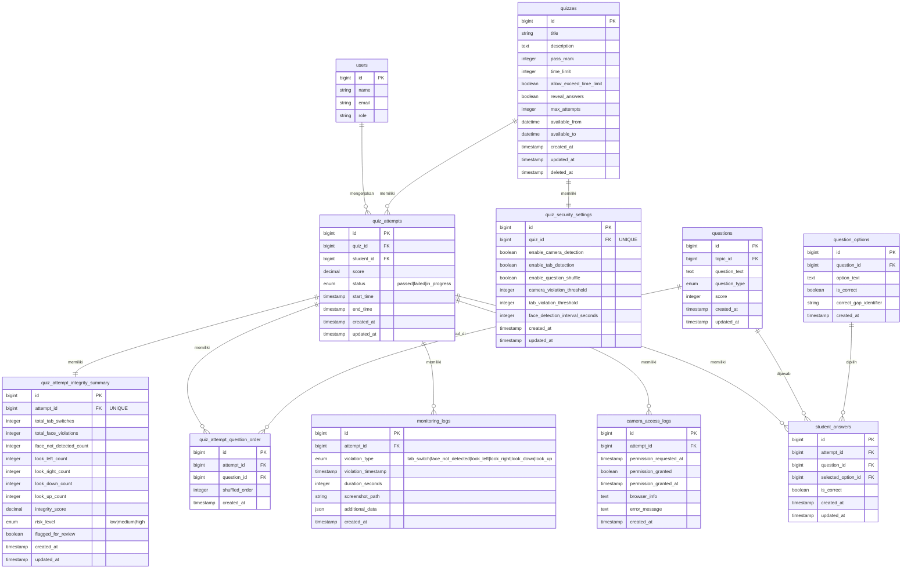
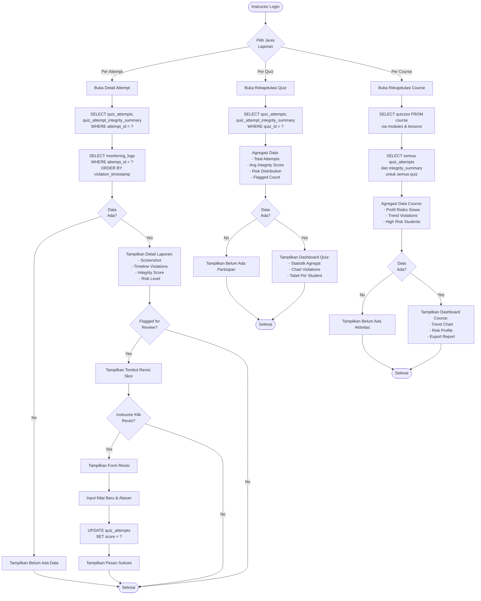
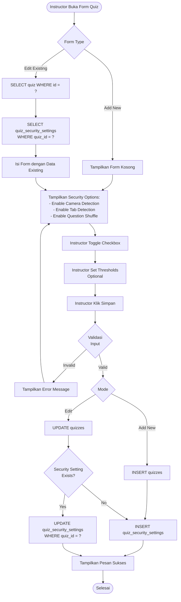
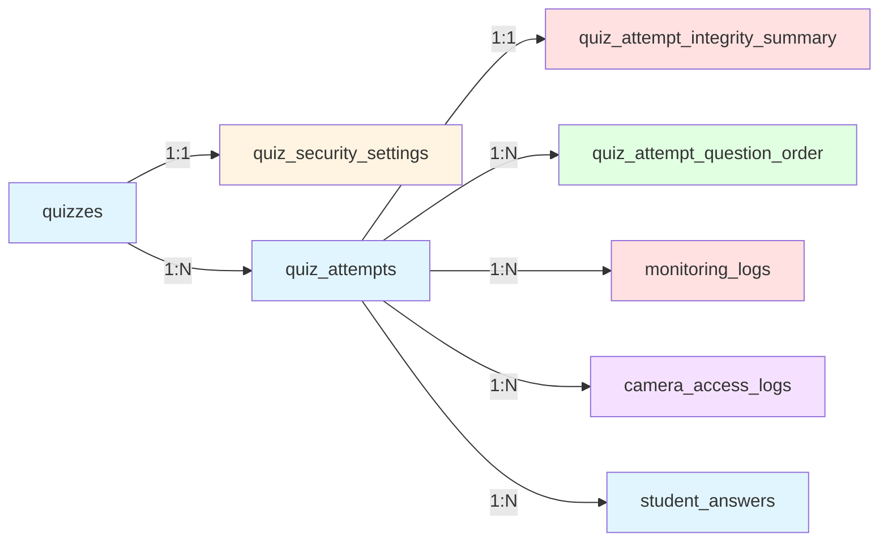

# Rancangan Relasi Database - Fitur Keamanan Kuis Online

## Platform E-Learning EduGames

## Diagram Relasi Antar Tabel (ERD)

## Diagram Alur Data - Student Mengerjakan Kuis

```mermaid
flowchart TD
    Start([Student Klik Mulai Kuis]) --> CheckSecurity{Cek Security Settings}

    CheckSecurity --> GetSettings[SELECT quiz_security_settings<br/>WHERE quiz_id = ?]
    GetSettings --> CameraEnabled{enable_camera_detection<br/>= TRUE?}

    CameraEnabled -->|Yes| RequestCamera[Request Camera Permission]
    RequestCamera --> LogCamera[INSERT camera_access_logs]
    LogCamera --> CameraGranted{Permission<br/>Granted?}

    CameraGranted -->|No| ShowError[Tampilkan Error & Stop]
    CameraGranted -->|Yes| CreateAttempt
    CameraEnabled -->|No| CreateAttempt

    CreateAttempt[INSERT quiz_attempts<br/>status = in_progress] --> ShuffleEnabled{enable_question_shuffle<br/>= TRUE?}

    ShuffleEnabled -->|Yes| FisherYates[Jalankan Fisher-Yates Shuffle]
    FisherYates --> SaveOrder[INSERT quiz_attempt_question_order<br/>untuk setiap soal dengan<br/>shuffled_order]
    SaveOrder --> DisplayQuiz

    ShuffleEnabled -->|No| DisplayQuiz[Tampilkan Soal ke Student]

    DisplayQuiz --> MonitoringStart[Start Monitoring]

    MonitoringStart --> TabDetection[Tab Detection<br/>JavaScript visibilitychange]
    MonitoringStart --> FaceDetection[Face Detection<br/>MediaPipe setiap X detik]

    TabDetection -->|Tab Switch| LogTab[INSERT monitoring_logs<br/>violation_type = tab_switch]

    FaceDetection -->|Face Not Detected| LogFaceNot[INSERT monitoring_logs<br/>violation_type = face_not_detected]
    FaceDetection -->|Look Left/Right/Up/Down| Capture[Capture Screenshot]
    Capture --> LogFace[INSERT monitoring_logs<br/>dengan screenshot_path]

    LogTab --> CheckThreshold{Total Violations<br/>> Threshold?}
    LogFace --> CheckThreshold
    LogFaceNot --> CheckThreshold

    CheckThreshold -->|Yes| ShowWarning[Tampilkan Warning ke Student]
    CheckThreshold -->|No| ContinueQuiz
    ShowWarning --> ContinueQuiz

    ContinueQuiz[Student Menjawab Soal] --> SaveAnswer[INSERT/UPDATE student_answers]
    SaveAnswer --> MoreQuestions{Ada Soal<br/>Lagi?}

    MoreQuestions -->|Yes| DisplayQuiz
    MoreQuestions -->|No| FinishQuiz[Student Klik Selesaikan/Timeout]

    FinishQuiz --> CalculateScore[Hitung Skor Akhir]
    CalculateScore --> CalculateIntegrity[Hitung Integrity Summary]

    CalculateIntegrity --> CountViolations[COUNT violations<br/>per type dari monitoring_logs]
    CountViolations --> CalcScore[integrity_score = 100 -<br/>total_violations * penalty]
    CalcScore --> DetermineRisk{Tentukan<br/>Risk Level}

    DetermineRisk -->|score >= 80| SetLow[risk_level = low]
    DetermineRisk -->|50 <= score < 80| SetMedium[risk_level = medium]
    DetermineRisk -->|score < 50| SetHigh[risk_level = high]

    SetLow --> CheckFlag
    SetMedium --> CheckFlag
    SetHigh --> CheckFlag

    CheckFlag{Violations ><br/>Threshold?} -->|Yes| FlagReview[flagged_for_review = TRUE]
    CheckFlag -->|No| NoFlag[flagged_for_review = FALSE]

    FlagReview --> UpdateAttempt
    NoFlag --> UpdateAttempt

    UpdateAttempt[UPDATE quiz_attempts<br/>SET score, status, end_time] --> InsertSummary[INSERT<br/>quiz_attempt_integrity_summary]

    InsertSummary --> ShowResult[Tampilkan Halaman Hasil<br/>Skor & Status Kelulusan]
    ShowResult --> End([Selesai])
```

## Diagram Alur - Instructor Melihat Laporan Integritas

## Diagram Alur - Setup Opsi Keamanan Kuis

## Tabel-Tabel Baru yang Dikembangkan

### 1. quiz_security_settings

**Tujuan:** Menyimpan konfigurasi keamanan per kuis

| Kolom                           | Tipe             | Deskripsi                          |
| ------------------------------- | ---------------- | ---------------------------------- |
| id                              | bigint PK        | Primary key                        |
| quiz_id                         | bigint FK UNIQUE | Foreign key ke quizzes             |
| enable_camera_detection         | boolean          | Aktifkan deteksi kamera            |
| enable_tab_detection            | boolean          | Aktifkan deteksi perpindahan tab   |
| enable_question_shuffle         | boolean          | Aktifkan pengacakan soal           |
| camera_violation_threshold      | integer          | Batas toleransi pelanggaran kamera |
| tab_violation_threshold         | integer          | Batas toleransi perpindahan tab    |
| face_detection_interval_seconds | integer          | Interval deteksi wajah (detik)     |

### 2. quiz_attempt_question_order

**Tujuan:** Menyimpan urutan soal yang telah diacak (Fisher-Yates)

| Kolom          | Tipe      | Deskripsi                    |
| -------------- | --------- | ---------------------------- |
| id             | bigint PK | Primary key                  |
| attempt_id     | bigint FK | Foreign key ke quiz_attempts |
| question_id    | bigint FK | Foreign key ke questions     |
| shuffled_order | integer   | Urutan soal setelah diacak   |

### 3. monitoring_logs

**Tujuan:** Mencatat semua pelanggaran selama quiz

| Kolom               | Tipe      | Deskripsi                      |
| ------------------- | --------- | ------------------------------ |
| id                  | bigint PK | Primary key                    |
| attempt_id          | bigint FK | Foreign key ke quiz_attempts   |
| violation_type      | enum      | Jenis pelanggaran              |
| violation_timestamp | timestamp | Waktu pelanggaran              |
| duration_seconds    | integer   | Durasi pelanggaran             |
| screenshot_path     | string    | Path foto bukti                |
| additional_data     | json      | Data tambahan (koordinat, dll) |

### 4. quiz_attempt_integrity_summary

**Tujuan:** Ringkasan integritas per attempt (untuk performa)

| Kolom                   | Tipe             | Deskripsi                          |
| ----------------------- | ---------------- | ---------------------------------- |
| id                      | bigint PK        | Primary key                        |
| attempt_id              | bigint FK UNIQUE | Foreign key ke quiz_attempts       |
| total_tab_switches      | integer          | Total perpindahan tab              |
| total_face_violations   | integer          | Total pelanggaran wajah            |
| face_not_detected_count | integer          | Berapa kali wajah tidak terdeteksi |
| look_left_count         | integer          | Berapa kali menoleh kiri           |
| look_right_count        | integer          | Berapa kali menoleh kanan          |
| look_down_count         | integer          | Berapa kali menunduk               |
| look_up_count           | integer          | Berapa kali mendongak              |
| integrity_score         | decimal(5,2)     | Skor integritas 0-100              |
| risk_level              | enum             | Level risiko (low/medium/high)     |
| flagged_for_review      | boolean          | Flag untuk review instructor       |

### 5. camera_access_logs

**Tujuan:** Audit trail akses kamera

| Kolom                   | Tipe      | Deskripsi                    |
| ----------------------- | --------- | ---------------------------- |
| id                      | bigint PK | Primary key                  |
| attempt_id              | bigint FK | Foreign key ke quiz_attempts |
| permission_requested_at | timestamp | Waktu request permission     |
| permission_granted      | boolean   | Apakah diizinkan             |
| permission_granted_at   | timestamp | Waktu izin diberikan         |
| browser_info            | text      | Info browser (user agent)    |
| error_message           | text      | Pesan error jika gagal       |

## Ringkasan Relasi

## Catatan Penting

1. **Fisher-Yates Shuffle**: Diimplementasikan saat quiz_attempt dibuat, hasil disimpan di `quiz_attempt_question_order`

2. **MediaPipe Face Mesh**: Berjalan di client-side (browser), mengirim violation ke backend via API

3. **Tab Detection**: Menggunakan JavaScript Page Visibility API, log dikirim real-time

4. **Integrity Score**: Dihitung saat quiz selesai berdasarkan total violations dengan formula penalty

5. **Storage**: Screenshot disimpan di `storage/app/monitoring_screenshots/` dengan naming convention `{attempt_id}_{timestamp}_{violation_type}.jpg`
