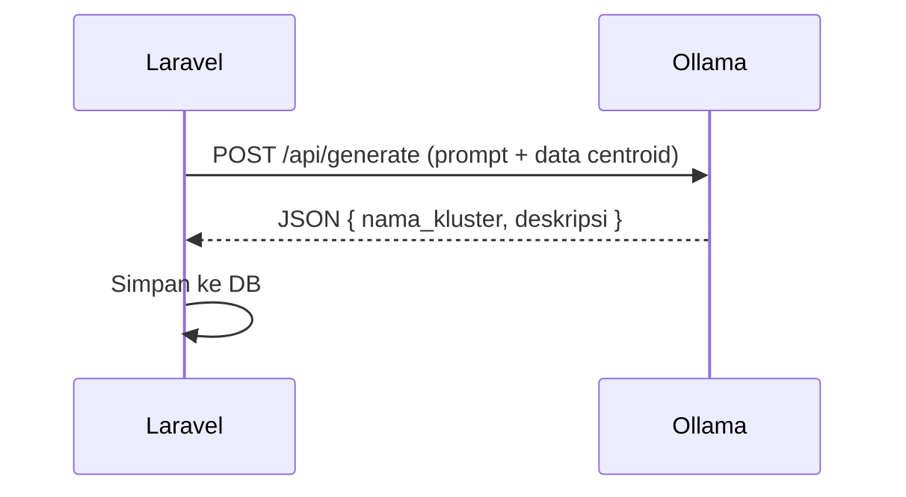
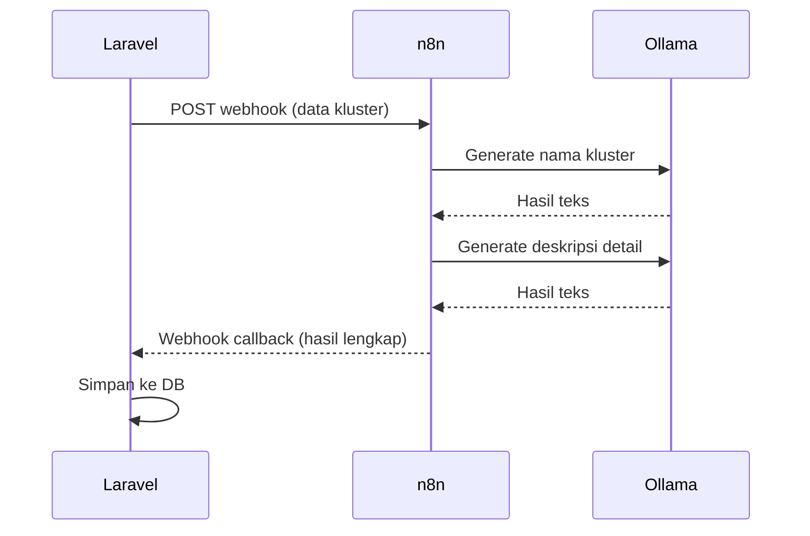
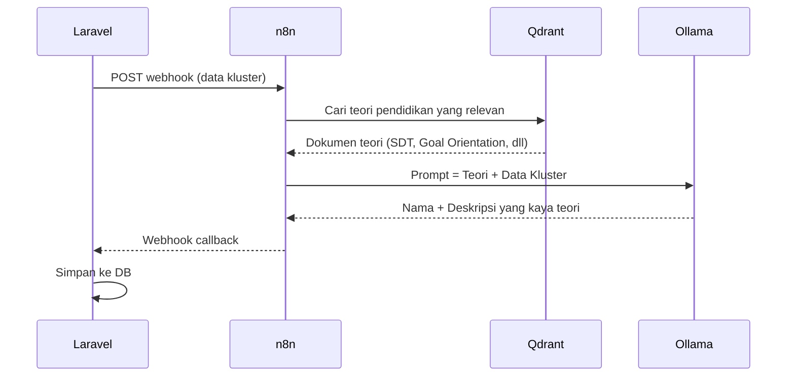

# Brainstorming: AI-Powered Cluster Labeling & Deskripsi

## Konteks Masalah

Saat ini, hasil K-Means menampilkan label generik ("Kluster 1", "Kluster 2") yang tidak memberikan makna pedagogis. Kita ingin AI secara otomatis:

1. **Memberi nama kluster** yang deskriptif (contoh: "Pelajar Mandiri Berpengetahuan Tinggi")
2. **Menulis deskripsi naratif** yang menjelaskan karakteristik siswa di kluster tersebut secara mendalam

---

## Infrastruktur yang Tersedia

| Service | Peran | Port (Docker) |
|---------|-------|---------------|
| **Ollama** | LLM inference lokal (generate teks) | `:11434` |
| **Qdrant** | Vector database (untuk RAG / semantic search) | `:6333` |
| **n8n** | Workflow automation (orchestrator) | `:5678` |

---

## Arsitektur: 3 Opsi

### Opsi A: Laravel → Ollama (Langsung)



**Kelebihan:**
- Paling sederhana, tanpa middleware tambahan
- Latensi minimal (satu hop)
- Mudah di-debug

**Kekurangan:**
- Laravel harus menunggu respons LLM (bisa 10-30 detik)
- Tidak ada enrichment dari knowledge base
- Prompt harus di-hardcode di PHP

---

### Opsi B: Laravel → n8n → Ollama



**Kelebihan:**
- n8n bisa mengorkestrasi multi-step prompt (nama → deskripsi → validasi)
- Visual workflow, mudah dimodifikasi tanpa deploy ulang
- Bisa retry otomatis jika Ollama timeout

**Kekurangan:**
- Tambahan satu hop latensi
- Perlu setup webhook callback ke Laravel
- Lebih kompleks untuk di-debug

---

### Opsi C: Laravel → n8n → Qdrant + Ollama (RAG) ⭐ Rekomendasi



**Kelebihan:**
- Deskripsi yang dihasilkan **berdasar teori pendidikan**, bukan sekadar membaca angka
- Bisa menyimpan ribuan paper/referensi di Qdrant tanpa membebani context window LLM
- Hasilnya akademis dan bisa digunakan di laporan penelitian
- Paling cocok untuk konteks LMS kampus

**Kekurangan:**
- Paling kompleks untuk disetup
- Perlu menyiapkan dokumen teori dan meng-embed-nya ke Qdrant terlebih dahulu
- Latensi paling tinggi (3 hop)

---

## Rekomendasi Arsitektur

> [!TIP]
> **Strategi bertahap: Mulai dari Opsi A, evolusi ke Opsi C.**
>
> 1. **Fase 1** → Implementasi Opsi A (Laravel → Ollama langsung). Ini sudah memberikan nilai tambah yang besar.
> 2. **Fase 2** → Migrasi ke Opsi B (via n8n) jika prompt-nya semakin kompleks.
> 3. **Fase 3** → Tambahkan Qdrant (RAG) untuk deskripsi berbasis teori pendidikan.

---

## Detail Teknis: Prompt Engineering

### Data yang Dikirim ke AI

Dari setiap kluster, kita sudah memiliki data centroid 10 dimensi. Kita tinggal mengubahnya ke format yang mudah dipahami LLM:

```json
{
  "course_name": "Digital Marketing Adaptive",
  "total_students": 15,
  "clusters": [
    {
      "cluster_number": 1,
      "student_count": 8,
      "centroid": {
        "mastery_goal": 55.56,
        "performance_goal": 44.44,
        "prior_knowledge": 66.67,
        "autonomy": 45.60,
        "competence": 25.23,
        "relatedness": 16.00,
        "transparency": 4.50,
        "guidance": 4.70,
        "adaptivity": 2.70,
        "feedback": 3.70
      },
      "students": ["Akhmad Nabil", "Student 3"]
    },
    {
      "cluster_number": 2,
      "student_count": 7,
      "centroid": { ... }
    }
  ]
}
```

### Contoh Prompt (System + User)

```
[SYSTEM]
Kamu adalah seorang ahli psikologi pendidikan dan data science. Tugasmu adalah
menganalisis hasil clustering K-Means pada profil belajar mahasiswa di sebuah
Learning Management System (LMS).

Setiap kluster memiliki centroid 10 dimensi:
- Goal Setting: Mastery Goal (%) dan Performance Goal (%) — mengukur orientasi belajar.
- Prior Knowledge: Persentase pengetahuan awal (0-100%).
- SDT (Self-Determination Theory): Autonomy (%), Competence (%), Relatedness (%)
  — mengukur motivasi intrinsik.
- AI Interaction: Transparency, Guidance, Adaptivity, Feedback (skala 1-5)
  — mengukur preferensi interaksi dengan AI tutor.

[USER]
Berikut adalah data 2 kluster dari kursus "Digital Marketing Adaptive":

**Kluster 1** (8 mahasiswa):
- Mastery: 55.56%, Performance: 44.44%
- Prior Knowledge: 66.67%
- Autonomy: 45.60%, Competence: 25.23%, Relatedness: 16.00%
- Transparency: 4.50, Guidance: 4.70, Adaptivity: 2.70, Feedback: 3.70

**Kluster 2** (7 mahasiswa):
- Mastery: 43.75%, Performance: 56.25%
- Prior Knowledge: 20.00%
- Autonomy: 24.32%, Competence: 34.78%, Relatedness: 50.45%
- Transparency: 4.50, Guidance: 4.30, Adaptivity: 4.30, Feedback: 1.70

Untuk SETIAP kluster, berikan:
1. **Nama Kluster**: Nama deskriptif dalam Bahasa Indonesia (maksimal 5 kata).
2. **Deskripsi**: Paragraf lengkap (150-250 kata) yang menjelaskan:
   - Karakteristik motivasi kelompok ini
   - Tingkat kesiapan kognitif mereka
   - Gaya belajar yang dominan
   - Preferensi mereka terhadap fitur AI
   - Rekomendasi strategi pengajaran yang sesuai

Format jawaban HARUS berupa JSON:
{
  "clusters": [
    {
      "cluster_number": 1,
      "name": "...",
      "description": "..."
    }
  ]
}
```

### Contoh Output yang Diharapkan

```json
{
  "clusters": [
    {
      "cluster_number": 1,
      "name": "Pelajar Mandiri Berpengetahuan Tinggi",
      "description": "Kelompok mahasiswa ini memiliki orientasi belajar yang
      seimbang antara penguasaan materi (Mastery 55.56%) dan pencapaian nilai
      (Performance 44.44%), dengan sedikit kecenderungan ke arah penguasaan.
      Mereka memiliki fondasi pengetahuan awal yang baik (66.67%), menunjukkan
      kesiapan kognitif yang memadai untuk menerima materi lanjutan. Dari sisi
      motivasi, kelompok ini sangat mandiri (Autonomy 45.60%) dan cenderung
      individualis (Relatedness 16.00%), lebih memilih belajar sendiri daripada
      kolaborasi kelompok. Mereka menginginkan AI yang transparan dan membimbing
      secara bertahap (Guidance 4.70), namun tidak terlalu membutuhkan
      penyesuaian otomatis (Adaptivity 2.70). Strategi pengajaran yang cocok:
      berikan jalur pembelajaran mandiri dengan milestone yang jelas, gunakan
      AI mentor sebagai fasilitator bukan pengajar utama, dan sediakan tantangan
      berbasis proyek individual."
    }
  ]
}
```

---

## Skema Database: Di Mana Menyimpan Hasil AI?

### Opsi 1: Kolom Baru di Tabel `kmeans_cluster_assignments`

Tidak ideal — tabel ini berisi data per-siswa, bukan per-kluster.

### Opsi 2: Kolom JSON di Tabel `kmeans_runs` ⭐ Rekomendasi

Tambahkan kolom `ai_labels` (JSON) di tabel `kmeans_runs`:

```php
// Migration
Schema::table('kmeans_runs', function (Blueprint $table) {
    $table->json('ai_labels')->nullable()->after('result_summary');
});
```

Format isi:

```json
{
  "generated_at": "2026-06-04T10:00:00Z",
  "model": "llama3.1:8b",
  "clusters": [
    {
      "cluster_number": 1,
      "name": "Pelajar Mandiri Berpengetahuan Tinggi",
      "description": "Kelompok mahasiswa ini memiliki orientasi..."
    },
    {
      "cluster_number": 2,
      "name": "Kolaborator Pemula Berorientasi Nilai",
      "description": "Kelompok ini didominasi oleh mahasiswa yang..."
    }
  ]
}
```

**Keuntungan:**
- Tidak perlu tabel baru
- Label AI terikat langsung ke run K-Means spesifik
- Jika K-Means dijalankan ulang, label lama otomatis digantikan

---

## Kapan AI Dipanggil?

### Opsi A: Otomatis setelah K-Means selesai (Sinkron)

Setelah `executeClustering()` selesai, langsung panggil Ollama. 

**Masalah:** User harus menunggu tambahan 10-30 detik.

### Opsi B: Otomatis via Background Job (Asinkron) ⭐ Rekomendasi

```php
// Di KMeansService::executeClustering()
$run = KmeansRun::create([...]);
$this->saveResults($run, ...);

// Dispatch ke Laravel Queue (async)
GenerateClusterLabelsJob::dispatch($run);

return $run;
```

User langsung melihat hasil clustering ("Kluster 1", "Kluster 2"). Beberapa detik kemudian, label AI muncul saat halaman di-refresh.

### Opsi C: On-Demand (Tombol Manual)

Tambahkan tombol "✨ Generate Label AI" di halaman hasil. User klik → loading → label muncul.

**Rekomendasi:** Gabungkan Opsi B + C. Auto-generate di background, tapi sediakan tombol regenerate jika user tidak puas dengan hasilnya.

---

## Model LLM yang Cocok di Ollama

| Model | VRAM | Bahasa Indonesia | Kecepatan | Cocok? |
|-------|------|-------------------|-----------|--------|
| `llama3.1:8b` | ~5GB | Cukup baik | Cepat | ✅ Rekomendasi |
| `llama3.1:70b` | ~40GB | Sangat baik | Lambat | ⚠️ Butuh GPU besar |
| `mistral:7b` | ~5GB | Kurang | Cepat | ❌ |
| `gemma2:9b` | ~6GB | Baik | Cepat | ✅ Alternatif |

> [!IMPORTANT]
> **Pastikan model yang terpasang di Ollama server mendukung Bahasa Indonesia** dengan baik, karena output harus dalam Bahasa Indonesia. `llama3.1:8b` adalah pilihan paling seimbang antara performa dan kualitas.

---

## Peran Qdrant (Fase Lanjutan)

Di fase awal, Qdrant belum wajib digunakan. Namun saat ingin meningkatkan kualitas deskripsi, kita bisa:

1. **Meng-embed dokumen teori pendidikan** ke Qdrant:
   - Teori SDT (Self-Determination Theory oleh Deci & Ryan)
   - Teori Goal Orientation (Mastery vs Performance)
   - Taksonomi Bloom untuk Prior Knowledge
   - Framework AI in Education

2. **Saat generate label**, n8n melakukan RAG:
   - Query: "siswa dengan autonomy tinggi dan relatedness rendah"
   - Qdrant mengembalikan kutipan teori yang relevan
   - Kutipan tersebut disisipkan ke prompt Ollama
   - Hasil: deskripsi yang menyitir teori akademis, cocok untuk laporan penelitian

---

## Pertanyaan Terbuka

1. **Bahasa output**: Apakah selalu Bahasa Indonesia, atau perlu opsi bilingual?
2. **Panjang deskripsi**: 150-250 kata cukup, atau perlu lebih panjang/pendek?
3. **Model Ollama**: Model apa yang sudah ter-install di server Docker saat ini?
4. **Fase implementasi**: Mulai dari Opsi A (langsung) atau langsung ke Opsi B (via n8n)?
