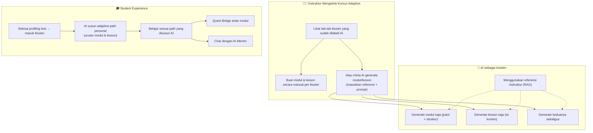
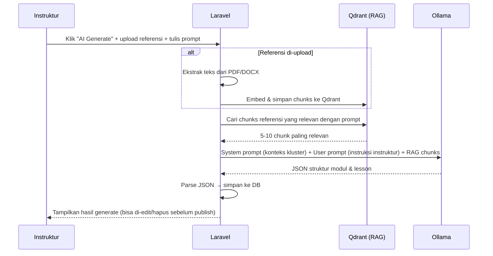
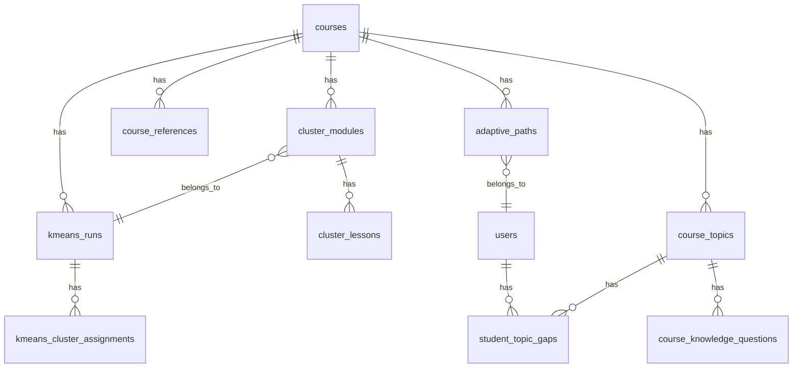
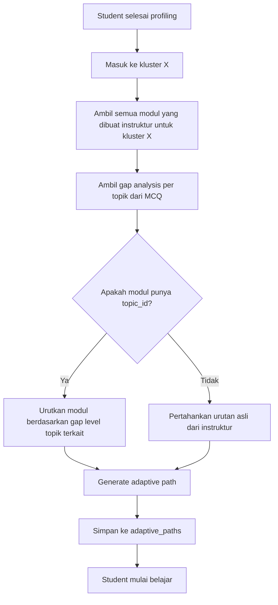
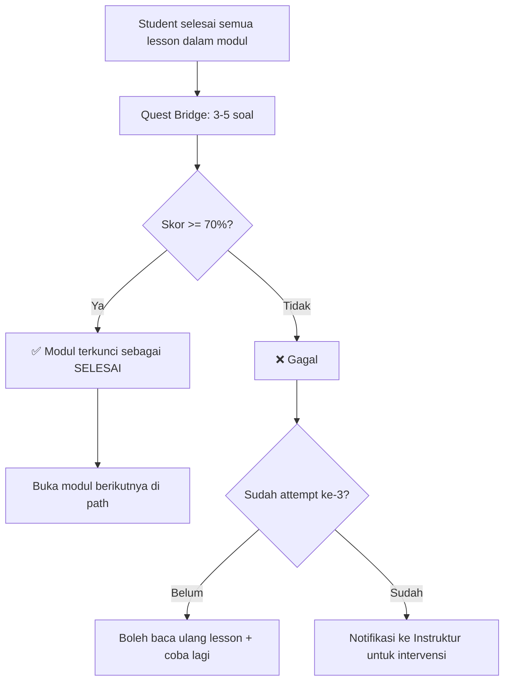
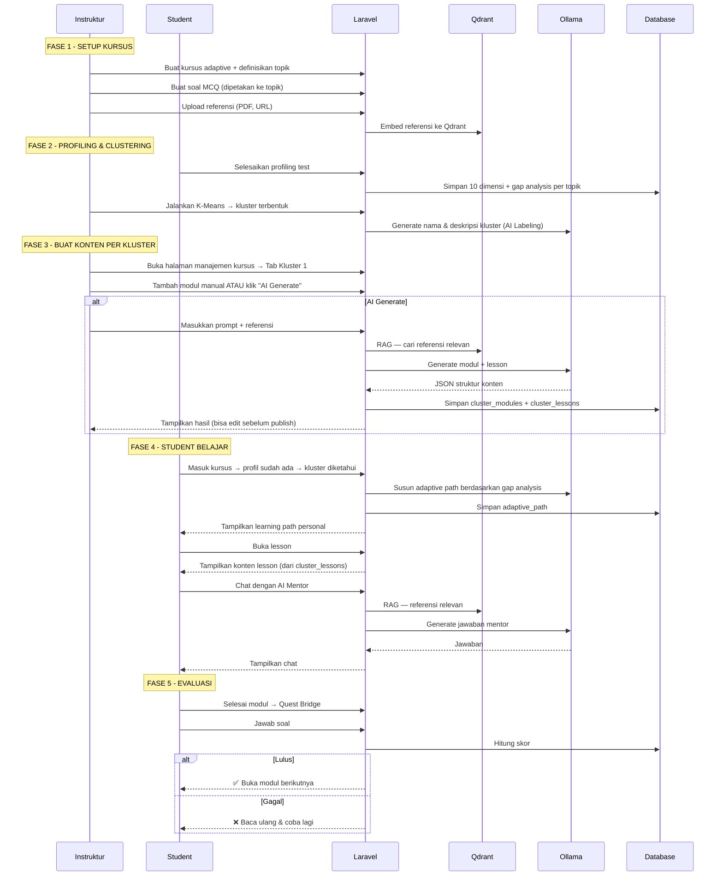

# Brainstorming: Fully AI-Assisted Adaptive Learning System (Revisi)

> **Revisi utama**: AI bukan pembuat konten otomatis, melainkan **asisten instruktur**. Konten modul dan lesson dikelola **per kluster profiling**, bukan per student. Personalisasi terjadi pada **urutan (adaptive path)** yang ditentukan AI berdasarkan profiling test masing-masing student.

---

## Konteks & Visi

### Alur Besar



### Poin Kunci Revisi

1. **Konten = per kluster**, bukan per student
   - Instruktur melihat tab: "Kluster 1: Pelajar Mandiri Berpengetahuan Tinggi", "Kluster 2: Kolaborator Pemula", dst.
   - Di dalam setiap tab, instruktur menambahkan modul & lesson yang sesuai untuk karakteristik kluster tersebut

2. **AI = Asisten**, bukan pembuat otomatis
   - Instruktur bisa membuat konten manual (seperti biasa)
   - Instruktur bisa meminta AI men-generate konten dengan memasukkan referensi + prompt
   - Opsi generate: hanya modul (struktur), hanya lesson (isi), atau keduanya

3. **Personalisasi = di urutan (path)**, bukan di konten
   - Setiap student yang masuk kluster yang sama mendapat **konten yang sama**
   - Yang berbeda adalah **urutan belajar** — AI menyusun adaptive path berdasarkan profiling test individual

---

## Komponen 1: UI Instruktur — Manajemen Kursus Adaptive per Kluster

### Wireframe Konsep Halaman

```
┌────────────────────────────────────────────────────────────────────────┐
│  Kursus: Digital Marketing Adaptive                                    │
│  K-Means terakhir: 4 Jun 2026 | K = 4 kluster                        │
├────────────────────────────────────────────────────────────────────────┤
│                                                                        │
│  ┌──────────────┐ ┌──────────────────┐ ┌──────────────┐ ┌───────────┐ │
│  │ 🔵 Kluster 1 │ │ 🟢 Kluster 2     │ │ 🟡 Kluster 3 │ │ 🔴 Kluster│ │
│  │ Pelajar      │ │ Kolaborator      │ │ Pengamat     │ │ 4 Pemula  │ │
│  │ Mandiri      │ │ Aktif            │ │ Pasif        │ │ Ambisius  │ │
│  └──────┬───────┘ └──────────────────┘ └──────────────┘ └───────────┘ │
│         │ (tab aktif)                                                  │
│  ───────┴──────────────────────────────────────────────────────────────│
│                                                                        │
│  📋 Deskripsi Kluster:                                                 │
│  "Kelompok mahasiswa ini memiliki orientasi belajar yang seimbang      │
│   antara penguasaan materi (Mastery 55.56%) dan pencapaian nilai..."   │
│  16 Siswa: Raphael, Ikhsan, Nathan, Ayman, ...                        │
│                                                                        │
│  ──────────────────────────────────────────────────────────────────── │
│                                                                        │
│  📚 Modul & Lesson untuk Kluster Ini:                                  │
│                                                                        │
│  ┌─ Modul 1: Fondasi SEO ──────────────────────────────────────────┐  │
│  │  ├── Lesson 1.1: Apa Itu SEO? [Artikel] [✏️ Edit] [🗑️ Hapus]   │  │
│  │  ├── Lesson 1.2: On-Page SEO  [Artikel] [✏️ Edit] [🗑️ Hapus]   │  │
│  │  └── [+ Tambah Lesson]  [✨ AI Generate Lesson]                 │  │
│  └─────────────────────────────────────────────────────────────────┘  │
│                                                                        │
│  ┌─ Modul 2: Pengenalan SEM ───────────────────────────────────────┐  │
│  │  ├── Lesson 2.1: Apa Itu SEM? [Artikel] [✏️ Edit] [🗑️ Hapus]   │  │
│  │  └── [+ Tambah Lesson]  [✨ AI Generate Lesson]                 │  │
│  └─────────────────────────────────────────────────────────────────┘  │
│                                                                        │
│  [+ Tambah Modul Manual]  [✨ AI Generate Modul]  [✨ AI Generate All]│
│                                                                        │
└────────────────────────────────────────────────────────────────────────┘
```

### Tab Kluster

- Setiap tab menampilkan **nama kluster** (dari AI labeling) + jumlah siswa
- Klik tab → tampilkan deskripsi kluster + daftar siswa + modul & lesson yang sudah dibuat
- Jika AI labeling belum jalan, tab tetap muncul sebagai "Kluster 1", "Kluster 2", dst.

### Aksi yang Tersedia per Kluster

| Aksi | Deskripsi |
|------|-----------|
| **+ Tambah Modul Manual** | Form standar: judul, deskripsi, urutan |
| **+ Tambah Lesson Manual** | Form: judul, konten (rich text editor), tipe (artikel/video/quiz) |
| **✨ AI Generate Modul** | Modal: masukkan referensi + prompt → AI generate struktur modul (judul, deskripsi, urutan) |
| **✨ AI Generate Lesson** | Modal: pilih modul target + masukkan referensi + prompt → AI generate isi lesson |
| **✨ AI Generate All** | Modal: masukkan referensi + prompt → AI generate modul-modul lengkap beserta lesson-lesson di dalamnya |

---

## Komponen 2: AI Generation — Modal & Alur

### Modal "✨ AI Generate Modul"

```
┌─────────────────────────────────────────────────────────┐
│  ✨ AI Generate Modul untuk Kluster "Pelajar Mandiri"    │
├─────────────────────────────────────────────────────────┤
│                                                         │
│  📎 Referensi (opsional):                               │
│  ┌───────────────────────────────────────────────────┐  │
│  │ [Drag & drop file PDF/DOCX, atau paste teks]      │  │
│  │                                                   │  │
│  │ 📄 materi_seo_lengkap.pdf  (uploaded)             │  │
│  │ 📄 panduan_sem_2026.docx   (uploaded)             │  │
│  └───────────────────────────────────────────────────┘  │
│                                                         │
│  📝 Prompt / Instruksi untuk AI:                        │
│  ┌───────────────────────────────────────────────────┐  │
│  │ Buatkan 4 modul untuk mahasiswa yang sudah        │  │
│  │ menguasai dasar-dasar digital marketing tapi      │  │
│  │ masih lemah di SEO teknis. Fokus ke SEO on-page,  │  │
│  │ SEO off-page, analitik, dan studi kasus.          │  │
│  └───────────────────────────────────────────────────┘  │
│                                                         │
│  ⚙️ Opsi Generate:                                      │
│  ○ Generate modul saja (judul + deskripsi)              │
│  ○ Generate lesson saja (untuk modul yang sudah ada)    │
│  ● Generate modul + lesson sekaligus                    │
│                                                         │
│  Jumlah modul yang diinginkan: [4]  ▼                   │
│  Jumlah lesson per modul (estimasi): [3-5]  ▼           │
│                                                         │
│         [Batal]     [✨ Generate dengan AI]              │
└─────────────────────────────────────────────────────────┘
```

### Alur Generate



### Prompt yang Dikirim ke AI

```
[SYSTEM]
Kamu adalah asisten pembuat kurikulum untuk sebuah Learning Management System.
Kamu akan membuatkan struktur modul dan lesson berdasarkan instruksi dosen.

KONTEKS KLUSTER MAHASISWA:
- Nama Kluster: {cluster_name}
- Deskripsi: {cluster_description}
- Jumlah Mahasiswa: {student_count}
- Profil Centroid:
  - Mastery Goal: {mastery}%, Performance Goal: {performance}%
  - Prior Knowledge: {knowledge}%
  - Autonomy: {autonomy}%, Competence: {competence}%, Relatedness: {relatedness}%
  - AI Preferences: Transparency {transparency}/5, Guidance {guidance}/5, 
    Adaptivity {adaptivity}/5, Feedback {feedback}/5

REFERENSI MATERI:
---
{rag_chunks}
---

[USER]
{instruksi_dari_instruktur}

Buatkan {jumlah_modul} modul dengan masing-masing {jumlah_lesson} lesson.

Format jawaban HARUS berupa JSON:
{
  "modules": [
    {
      "title": "...",
      "description": "...",
      "order": 1,
      "lessons": [
        {
          "title": "...",
          "content": "... (konten lesson dalam Markdown, minimal 500 kata) ...",
          "type": "article",
          "order": 1,
          "estimated_minutes": 15
        }
      ]
    }
  ]
}
```

---

## Komponen 3: Skema Database — Konten per Kluster

### Perbedaan dengan Konsep Sebelumnya

| Konsep Lama | Konsep Baru (Revisi) |
|-------------|---------------------|
| `adaptive_lessons` → per student | `cluster_modules` + `cluster_lessons` → per kluster |
| Ratusan record per kursus (1 per student per lesson) | Puluhan record per kursus (1 per kluster per lesson) |
| AI wajib generate semua | Instruktur bisa manual, AI opsional |

### Tabel: `cluster_modules`

```sql
CREATE TABLE cluster_modules (
    id BIGINT PRIMARY KEY AUTO_INCREMENT,
    course_id BIGINT NOT NULL,
    cluster_number INT NOT NULL,           -- nomor kluster (1, 2, 3, ...)
    kmeans_run_id BIGINT NULL,             -- run K-Means yang aktif saat modul dibuat
    title VARCHAR(500) NOT NULL,
    description TEXT NULL,
    `order` INT DEFAULT 0,
    is_ai_generated BOOLEAN DEFAULT FALSE, -- apakah dibuat oleh AI?
    ai_generation_prompt TEXT NULL,         -- prompt yang digunakan (audit trail)
    created_at TIMESTAMP,
    updated_at TIMESTAMP,
    
    FOREIGN KEY (course_id) REFERENCES courses(id),
    FOREIGN KEY (kmeans_run_id) REFERENCES kmeans_runs(id)
);
```

### Tabel: `cluster_lessons`

```sql
CREATE TABLE cluster_lessons (
    id BIGINT PRIMARY KEY AUTO_INCREMENT,
    cluster_module_id BIGINT NOT NULL,
    title VARCHAR(500) NOT NULL,
    content LONGTEXT NULL,                 -- konten Markdown/HTML
    lesson_type ENUM('article', 'video', 'quiz', 'assignment', 'exercise') DEFAULT 'article',
    `order` INT DEFAULT 0,
    estimated_minutes INT DEFAULT 15,
    is_ai_generated BOOLEAN DEFAULT FALSE,
    ai_generation_prompt TEXT NULL,
    rag_sources TEXT NULL,                 -- referensi yang digunakan AI (untuk transparansi)
    created_at TIMESTAMP,
    updated_at TIMESTAMP,
    
    FOREIGN KEY (cluster_module_id) REFERENCES cluster_modules(id) ON DELETE CASCADE
);
```

### Tabel: `course_references` (Referensi Instruktur untuk RAG)

```sql
CREATE TABLE course_references (
    id BIGINT PRIMARY KEY AUTO_INCREMENT,
    course_id BIGINT NOT NULL,
    uploaded_by BIGINT NOT NULL,
    title VARCHAR(255),
    type ENUM('pdf', 'docx', 'url', 'text') NOT NULL,
    file_path VARCHAR(500) NULL,
    url VARCHAR(500) NULL,
    raw_text LONGTEXT NULL,
    qdrant_collection VARCHAR(255) NULL,
    chunk_count INT DEFAULT 0,
    processing_status ENUM('pending', 'processing', 'completed', 'failed') DEFAULT 'pending',
    created_at TIMESTAMP,
    updated_at TIMESTAMP,
    
    FOREIGN KEY (course_id) REFERENCES courses(id),
    FOREIGN KEY (uploaded_by) REFERENCES users(id)
);
```

### Relasi Entity



---

## Komponen 4: Adaptive Path — AI Menyusun Urutan per Student

### Konsep

Meskipun **konten** sama untuk semua student dalam satu kluster, **urutan modul dan lesson** yang disajikan ke setiap student **berbeda** berdasarkan gap analysis dari prior knowledge MCQ mereka.

### Contoh

Instruktur sudah membuat 4 modul untuk Kluster 1:
1. Modul: Fondasi SEO
2. Modul: Teknik SEM  
3. Modul: Analytics & Metrik
4. Modul: Content Marketing

**Student A** (lemah SEO, kuat SEM):
```
Path: Fondasi SEO → Analytics & Metrik → Content Marketing → Teknik SEM (review)
```

**Student B** (lemah SEM, kuat SEO):
```
Path: Teknik SEM → Analytics & Metrik → Content Marketing → Fondasi SEO (review)
```

**Student C** (lemah semua):
```
Path: Fondasi SEO → Teknik SEM → Analytics & Metrik → Content Marketing (semua wajib, urut dari yang paling lemah)
```

### Skema Database: `adaptive_paths`

```sql
CREATE TABLE adaptive_paths (
    id BIGINT PRIMARY KEY AUTO_INCREMENT,
    student_id BIGINT NOT NULL,
    course_id BIGINT NOT NULL,
    cluster_number INT NOT NULL,           -- kluster yang ditempati student
    attempt_id BIGINT NOT NULL,            -- profiling_attempt_id
    path_data JSON NOT NULL,               -- urutan modul & lesson (lihat contoh)
    generation_status ENUM('pending', 'generating', 'completed', 'failed') DEFAULT 'pending',
    generated_by VARCHAR(50) NULL,
    total_modules INT DEFAULT 0,
    total_lessons INT DEFAULT 0,
    current_module_order INT DEFAULT 1,    -- modul yang sedang dikerjakan
    current_lesson_order INT DEFAULT 1,    -- lesson yang sedang dikerjakan
    progress_pct DECIMAL(5,2) DEFAULT 0,
    created_at TIMESTAMP,
    updated_at TIMESTAMP,
    
    FOREIGN KEY (student_id) REFERENCES users(id),
    FOREIGN KEY (course_id) REFERENCES courses(id),
    FOREIGN KEY (attempt_id) REFERENCES profiling_attempts(id)
);
```

### Contoh `path_data` JSON

```json
{
  "cluster_number": 1,
  "cluster_name": "Pelajar Mandiri Berpengetahuan Tinggi",
  "gap_analysis": {
    "weakest_topics": ["SEO"],
    "moderate_topics": ["Analytics"],
    "strong_topics": ["SEM", "Content Marketing"]
  },
  "ordered_modules": [
    {
      "path_order": 1,
      "cluster_module_id": 12,
      "title": "Fondasi SEO",
      "priority": "critical",
      "reason": "Akurasi prior knowledge SEO hanya 33%",
      "is_skippable": false,
      "lessons": [
        { "cluster_lesson_id": 31, "title": "Apa Itu SEO?", "path_order": 1 },
        { "cluster_lesson_id": 32, "title": "On-Page SEO", "path_order": 2 },
        { "cluster_lesson_id": 33, "title": "Off-Page SEO", "path_order": 3 }
      ],
      "quest_bridge_after": true
    },
    {
      "path_order": 2,
      "cluster_module_id": 15,
      "title": "Analytics & Metrik",
      "priority": "medium",
      "reason": "Akurasi Analytics 50%",
      "is_skippable": false,
      "lessons": [
        { "cluster_lesson_id": 41, "title": "Memahami CTR", "path_order": 1 },
        { "cluster_lesson_id": 42, "title": "Bounce Rate", "path_order": 2 }
      ],
      "quest_bridge_after": true
    },
    {
      "path_order": 3,
      "cluster_module_id": 14,
      "title": "Teknik SEM",
      "priority": "review",
      "reason": "Akurasi SEM 100% — review singkat saja",
      "is_skippable": true,
      "lessons": [
        { "cluster_lesson_id": 36, "title": "Ringkasan SEM", "path_order": 1 }
      ],
      "quest_bridge_after": false
    }
  ]
}
```

### Logika AI untuk Menyusun Path



### Hubungan Modul ↔ Topik

Agar AI bisa mengurutkan modul berdasarkan gap, setiap modul perlu **opsional** dihubungkan ke topik:

```sql
ALTER TABLE cluster_modules 
ADD COLUMN topic_id BIGINT NULL AFTER cluster_number,
ADD FOREIGN KEY (topic_id) REFERENCES course_topics(id);
```

Jika instruktur mengisi `topic_id`, AI tahu modul ini terkait topik apa → bisa mengurutkan berdasarkan gap.
Jika tidak diisi, modul tetap muncul di path sesuai urutan asli instruktur.

---

## Komponen 5: Gap Analysis Engine

### Tabel: `course_topics`

```sql
CREATE TABLE course_topics (
    id BIGINT PRIMARY KEY AUTO_INCREMENT,
    course_id BIGINT NOT NULL,
    name VARCHAR(255) NOT NULL,
    description TEXT NULL,
    `order` INT DEFAULT 0,
    created_at TIMESTAMP,
    updated_at TIMESTAMP,
    
    FOREIGN KEY (course_id) REFERENCES courses(id)
);
```

### Hubungkan MCQ ke Topik

```sql
ALTER TABLE course_knowledge_questions 
ADD COLUMN topic_id BIGINT NULL AFTER course_id,
ADD FOREIGN KEY (topic_id) REFERENCES course_topics(id);
```

### Tabel: `student_topic_gaps`

```sql
CREATE TABLE student_topic_gaps (
    id BIGINT PRIMARY KEY AUTO_INCREMENT,
    student_id BIGINT NOT NULL,
    course_id BIGINT NOT NULL,
    topic_id BIGINT NOT NULL,
    attempt_id BIGINT NOT NULL,
    total_questions INT NOT NULL,
    correct_answers INT NOT NULL,
    accuracy_pct DECIMAL(5,2) NOT NULL,
    gap_level ENUM('none', 'low', 'medium', 'high', 'critical') NOT NULL,
    priority_order INT DEFAULT 0,
    created_at TIMESTAMP,
    updated_at TIMESTAMP,
    
    FOREIGN KEY (student_id) REFERENCES users(id),
    FOREIGN KEY (course_id) REFERENCES courses(id),
    FOREIGN KEY (topic_id) REFERENCES course_topics(id),
    FOREIGN KEY (attempt_id) REFERENCES profiling_attempts(id),
    UNIQUE KEY unique_gap (student_id, course_id, topic_id, attempt_id)
);
```

### Klasifikasi Gap

| Akurasi MCQ | Gap Level | Dampak pada Path |
|-------------|-----------|-----------------|
| 80-100% | `none` | Modul bisa di-skip, atau ditaruh di akhir sebagai review |
| 60-79% | `low` | Modul ditaruh setelah topik yang lebih lemah |
| 40-59% | `medium` | Modul prioritas sedang |
| 20-39% | `high` | Modul prioritas tinggi, di depan |
| 0-19% | `critical` | Modul PALING pertama, tidak bisa di-skip |

---

## Komponen 6: AI Mentor (Chatbot)

### Konsep

AI Mentor tetap tersedia sebagai chatbot percakapan di halaman lesson. Yang berubah:
- Konteksnya sekarang adalah **konten lesson yang dibuat/di-generate instruktur** (bukan konten per-student)
- AI Mentor memanfaatkan **profil kluster** + **gap analysis individual** + **referensi instruktur (RAG)**

### System Prompt (Dinamis per Student)

```
[SYSTEM]
Kamu adalah AI Mentor di platform LMS. Kamu membantu {student_name} 
mempelajari kursus "{course_name}".

PROFIL MAHASISWA:
- Kluster: {cluster_name}
- Deskripsi kluster: {cluster_description}
- Prior Knowledge: {knowledge_pct}%
- Gap topik saat ini ({current_topic}): {gap_level}
- Preferensi: Guidance {guidance}/5, Transparency {transparency}/5, 
  Feedback {feedback}/5

LESSON YANG SEDANG DIBACA:
---
{current_lesson_content}
---

REFERENSI TAMBAHAN:
---
{rag_chunks_from_instructor_references}
---

ATURAN:
1. Jawab dalam Bahasa Indonesia
2. Sesuaikan gaya bicara dengan preferensi mahasiswa
3. Jika gap_level critical/high → jelaskan sangat detail, gunakan analogi
4. Jika gap_level none/low → jawab ringkas, tantang dengan pertanyaan lanjutan
5. Jangan berikan jawaban quiz secara langsung
```

### Skema Database: `ai_mentor_conversations`

```sql
CREATE TABLE ai_mentor_conversations (
    id BIGINT PRIMARY KEY AUTO_INCREMENT,
    student_id BIGINT NOT NULL,
    course_id BIGINT NOT NULL,
    cluster_lesson_id BIGINT NULL,
    messages JSON NOT NULL,
    model_used VARCHAR(50) NULL,
    total_messages INT DEFAULT 0,
    created_at TIMESTAMP,
    updated_at TIMESTAMP,
    
    FOREIGN KEY (student_id) REFERENCES users(id),
    FOREIGN KEY (course_id) REFERENCES courses(id),
    FOREIGN KEY (cluster_lesson_id) REFERENCES cluster_lessons(id)
);
```

---

## Komponen 7: Quest Bridge (Evaluasi Adaptif)

### Konsep

Quest Bridge ditempatkan di **akhir modul** (bukan akhir lesson). Soal bisa:
- Dibuat manual oleh instruktur
- Di-generate AI berdasarkan konten modul + referensi

### Alur



### Skema Database: `adaptive_quest_bridges`

```sql
CREATE TABLE adaptive_quest_bridges (
    id BIGINT PRIMARY KEY AUTO_INCREMENT,
    student_id BIGINT NOT NULL,
    course_id BIGINT NOT NULL,
    path_id BIGINT NOT NULL,
    cluster_module_id BIGINT NOT NULL,
    questions JSON NOT NULL,
    answers JSON NULL,
    score DECIMAL(5,2) NULL,
    passed BOOLEAN NULL,
    passing_threshold DECIMAL(5,2) DEFAULT 70.00,
    attempt_number INT DEFAULT 1,
    created_at TIMESTAMP,
    updated_at TIMESTAMP,
    
    FOREIGN KEY (student_id) REFERENCES users(id),
    FOREIGN KEY (course_id) REFERENCES courses(id),
    FOREIGN KEY (path_id) REFERENCES adaptive_paths(id),
    FOREIGN KEY (cluster_module_id) REFERENCES cluster_modules(id)
);
```

---

## Komponen 8: Student Experience — Navigasi Adaptive

### Halaman Learning Path Student

```
┌────────────────────────────────────────────────────────────────┐
│  📚 Learning Path Personalmu — Digital Marketing Adaptive      │
│  Kluster: Pelajar Mandiri Berpengetahuan Tinggi               │
│  Progress: ████████░░░░░░░░ 45%                               │
├────────────────────────────────────────────────────────────────┤
│                                                                │
│  🔴 Modul 1: Fondasi SEO (Prioritas: Critical)               │
│     "Akurasi prior knowledge SEO kamu hanya 33%"              │
│     ├── ✅ Lesson 1.1: Apa Itu SEO?                           │
│     ├── ✅ Lesson 1.2: On-Page SEO                            │
│     ├── 📖 Lesson 1.3: Off-Page SEO ← (sedang di sini)       │
│     └── 🏆 Quest Bridge 1 (terkunci)                          │
│                                                                │
│  🟡 Modul 2: Analytics & Metrik (Prioritas: Medium)           │
│     "Akurasi Analytics 50%, perlu pendalaman"                 │
│     ├── 🔒 Lesson 2.1: Memahami CTR                          │
│     ├── 🔒 Lesson 2.2: Bounce Rate & Dwell Time              │
│     └── 🔒 Quest Bridge 2                                     │
│                                                                │
│  🟢 Modul 3: Teknik SEM (Prioritas: Review)                  │
│     "SEM sudah dikuasai — review singkat" [Skip tersedia]      │
│     ├── 🔒 Lesson 3.1: Ringkasan SEM                         │
│     └── (Tidak ada Quest Bridge)                               │
│                                                                │
│  💬 [Chat dengan AI Mentor]                                    │
│                                                                │
└────────────────────────────────────────────────────────────────┘
```

### Fitur Navigasi

| Fitur | Deskripsi |
|-------|-----------|
| **Progress Bar** | Persentase lesson yang sudah selesai dari total path |
| **Lock/Unlock** | Modul berikutnya terkunci sampai Quest Bridge sebelumnya lulus |
| **Skip** | Modul dengan priority "review/none" bisa di-skip oleh student yang Autonomy-nya tinggi |
| **Alasan Urutan** | Setiap modul menampilkan alasan mengapa ditempatkan di posisi tersebut |
| **AI Mentor** | Floating button chat yang selalu tersedia |

---

## Ringkasan Tabel Database Baru (Revisi)

| Tabel | Fungsi |
|-------|--------|
| `course_topics` | Topik-topik dalam kursus (SEO, SEM, dst.) |
| `course_references` | Referensi/materi mentah yang di-upload instruktur |
| `cluster_modules` | Modul per kluster (dibuat instruktur / AI) |
| `cluster_lessons` | Lesson per modul per kluster (dibuat instruktur / AI) |
| `student_topic_gaps` | Hasil analisis gap per student per topik |
| `adaptive_paths` | Jalur belajar personal per student (urutan modul) |
| `adaptive_quest_bridges` | Soal evaluasi antar modul |
| `ai_mentor_conversations` | Histori chat AI Mentor |
| ALTER: `course_knowledge_questions` | Tambah `topic_id` |
| ALTER: `cluster_modules` | Tambah `topic_id` |

---

## Alur End-to-End (Revisi)



---

## Pertanyaan Terbuka (Revisi)

1. **Topik Kursus**: Instruktur mendefinisikan topik manual, atau AI assist mengekstrak dari referensi?

2. **Konten saat Kluster Berubah**: Jika K-Means dijalankan ulang dan kluster berubah (misal dari 4 jadi 5), bagaimana dengan konten modul/lesson yang sudah dibuat untuk kluster lama?

3. **Mapping Modul ↔ Topik**: Apakah wajib setiap modul dihubungkan ke topik (untuk adaptive path), atau opsional?

4. **Draft vs Publish**: Setelah AI generate konten, apakah langsung live atau masuk "draft" yang harus di-review instruktur dulu?

5. **Quest Bridge**: Soalnya dibuat instruktur manual, di-generate AI, atau keduanya?

6. **Batas Remedial**: Berapa kali student boleh gagal Quest Bridge sebelum eskalasi ke instruktur?

7. **Akses Konten Lintas Kluster**: Jika student di Kluster 1, bisakah dia melihat konten yang dibuat untuk Kluster 2?
